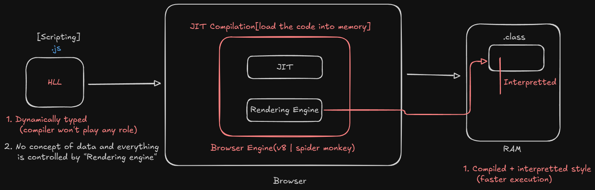
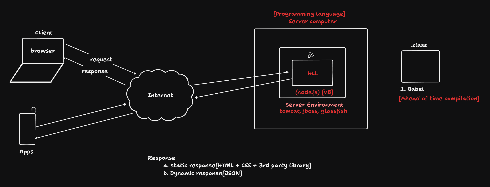
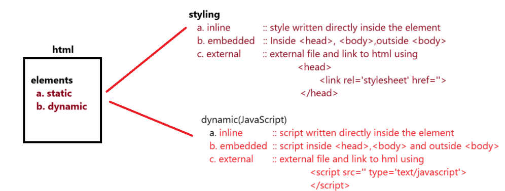
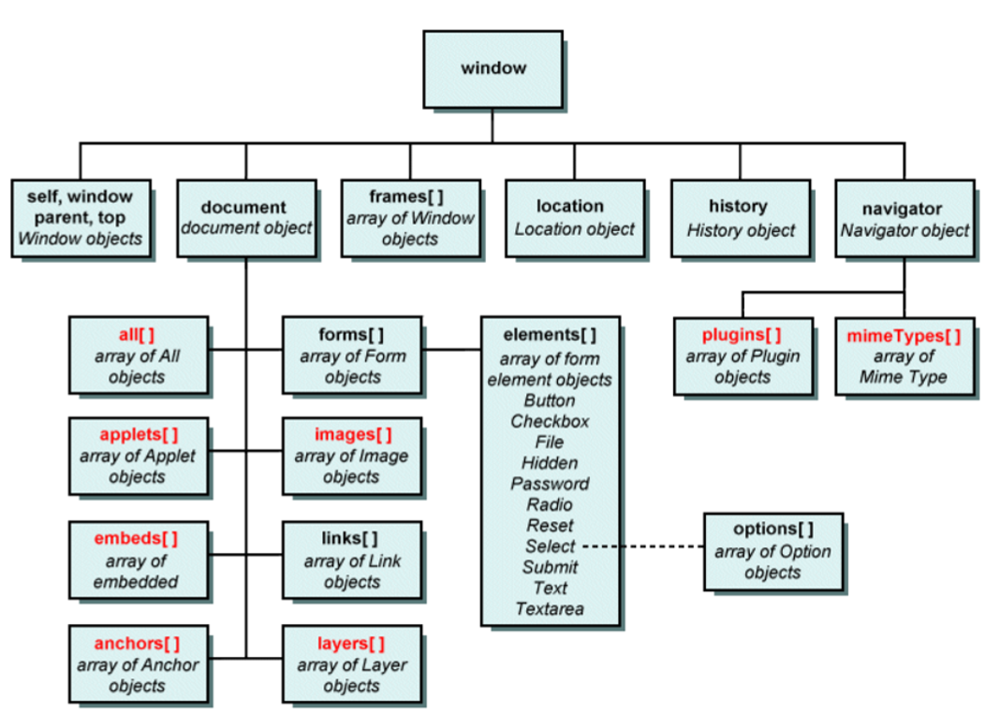
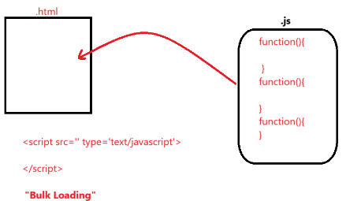
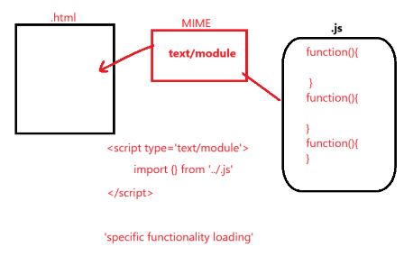
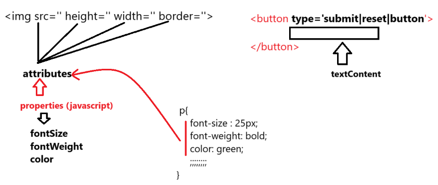
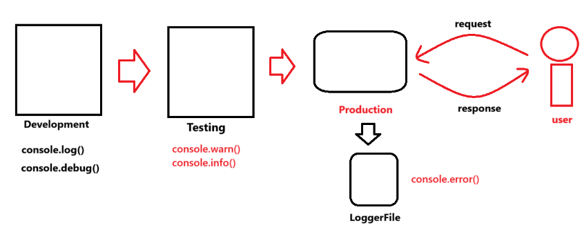
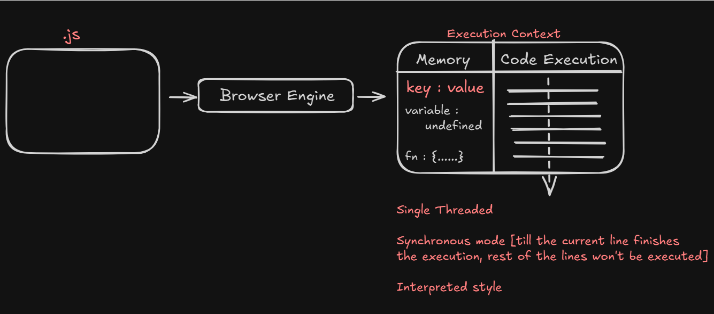
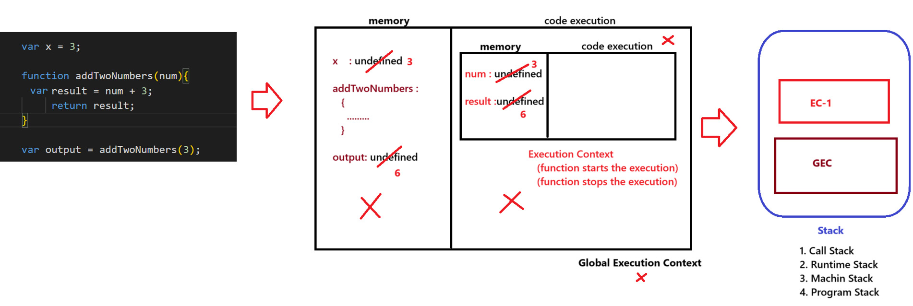

# 🟨 JavaScript

#### JavaScript is a lightweight, interpreted, and Just-in-Time (JIT) compiled programming language.

- **Lightweight**: Refers to the memory it occupies and how heavy the application is.
- **Interpreted**: Refers to line-by-line translation.
- **Compiled**: Refers to translating the entire program at once — all lines are translated simultaneously.



---

## 🌐 Client-Server Architecture



---

## ⚙️ Compilation Types

### a) 🔄 JIT (Just-in-Time) Compiled

- JIT is the process where JavaScript is loaded into the browser and compiled there.  
  This happens **when the user sends a request**.

### b) 🚀 AOT (Ahead-of-Time) Compiled

- AOT is the process where JavaScript is compiled and processed at the application level —  
  **even before any request is made**.

---

## 🧩 Engines and Compilers

- Some of the engines and compilers that can be used with JavaScript include:
  - **Ivy**
  - **Babel**
  - **Node**
  - **V8**


## 🧠 JavaScript Programming Approaches

- JavaScript supports various programming techniques and approaches:
  - **Structural Programming**
  - **Functional Programming**
  - **Imperative Programming**
  - **Object-Oriented Programming** *(limited)*

> 🔔 **Note:** *JavaScript is not a pure OOP language. It supports only a few features of OOP.*

---

## 🧩 JavaScript Usage in Different Layers

- JavaScript is a `programming language` used at different layers of a project:
  - 📄 **Client Side** — with `HTML`
  - 🌐 **Server Side** — with `Node.js`
  - 🗃️ **Database** — `MongoDB`
  - 🎞️ **Animation Tools** — *Flash*, *3DS Max*, etc.


## 🛠️ Full Stack JavaScript Flow
- **Frontend**
  - `React.js`

- **Backend**
  - `Node.js`
  - `Express.js`

- **Database**
  - `MongoDB (JavaScript based)`

## ❓ FAQ

### 1. What are the issues with JavaScript?

- **JavaScript is not "strongly" typed**
  - Example:
    ```javascript
    a = 10;
    a = "sachin";
    a = false;
    a = 13.5;
    ```
  - No fixed data type is enforced on a variable.

---
- **JavaScript is not "strictly" typed**
  - Example:
    ```javascript
    "use strict";
    a = 10; // Allowed even without declaration
    ```
  - Variables can be used without being declared unless strict mode is enabled.

---

- **JavaScript doesn't restrict uniform data structure**
  - Example:
    ```javascript
    [
      {
        Name: "samsung",
        price: 45000
      },
      {
        Product: "LG",
        cost: 55000
      }
    ]
    ```
  - Object keys and values are not enforced to follow a consistent schema.

---

- **JavaScript is not fully secure**
  - It can be blocked or manipulated by the browser.
  - Susceptible to misuse if used improperly.

  #### Examples:

  | Type  | Tool         | Description                                                |
  |-------|--------------|------------------------------------------------------------|
  | ❌ Bad | `Trojan`     | Installs secretly, allowing device control without consent |
  | ✅ Good | `TeamViewer` | Used for remote access with user permission                |

# 🌐 JavaScript Client Side

- The main purpose of JavaScript on the **client side** is to avoid burdening the server.

- It can **improve application performance** by handling various interactions on the client side.

---

## ⚙️ Interactions at the Client Side

### a. DOM Manipulations

- Adding elements into the page  
- Removing elements from the page  
- Updating data in elements  
- Configuring styles dynamically  
- Attaching events dynamically  

---

### b. Validations

- JavaScript is used to **verify user input** on the client side before sending it to the server.

---

### c. Client-Side Management

- **Managing Client Memory**  
  - e.g., Username and password stored in cache memory

- **Managing Client Devices**  
  - e.g., Booking a ticket and printing it offline (no internet needed)

- **Managing User Location**  
  - e.g., Websites that ask for your location

- **Data Sharing with Other Applications**  
  - e.g., Sharing files or data from the browser with installed apps

### 💡 How does JavaScript take control over HTML elements, or in how many ways can we use JavaScript code in an HTML page?



### Window Heirarchy



### ❓ FAQ

- 1️⃣ What is the MIME type for script?

  - `<script type='text/javascript'>` — Bulk loading  
    

  - `<script type='text/module'>` — Module-based loading (⚡ higher performance)  
    

---

- 2️⃣ What is the difference between script in `<head>` and `<body>`?

  - **Head**: Script is loaded into **browser memory** and later used in the page  
  - **Body**: Script is loaded **directly into the page** and is not stored in browser memory

---

- 3️⃣ How does JavaScript convert Static DOM into Dynamic DOM?
  - **HTML →** HTML parser → Static DOM(Document Object Model)
  - **CSS →** CSS parser → Uses static DOM and changes the style of an element using CSSOM(CSS Object Model).
  - **JS →** JavaScript engine → Uses STATIC DOM and converts it into Dynamic DOM using 'events and functions'.

---

- 4️⃣ What is strict mode in JavaScript?

  - If we want to prevent JavaScript from using undeclared variables, we use `"strict mode"`.

  ```html
  <script type="text/javascript">
    "use strict";
    a = 10;
    console.log(a); // ❌ Uncaught ReferenceError: a is not defined
  </script>
  ```

--- 

- 5️⃣ How to target JavaScript for Legacy browsers? (Old Version Browsers)

  - Developers can target new JavaScript code to legacy browsers by enclosing the code in HTML comments.

  ```html
  <script type="text/javascript">
    <!--
      "use strict";
      // your code here...
    -->
  </script>
  ```
---
- 6️⃣ How to link an external JavaScript file to HTML?
  ```html
  <script src="yourfile.js"></script>
  ```

---

### 🔍 JavaScript `properties` vs `textContent`



> 💻 Related Code : 
[dom-heirarchy-code.html](javascript-examples/dom-heirarchy-code.html)

---
### ⚠️ Disadvantage of Using DOM Hierarchy for Targeting Elements

- If we target elements using **DOM hierarchy**, the code might **break** when the DOM structure is altered or changed.


- ✅ Solution : Use **ID** to target the element directly and reliably:
  ```javascript
  document.getElementById("myElement");
  ```


### 🆔 Targeting Elements Using ID Selector

- We use the method:
  ```javascript
  const oneElement = document.getElementById('idname');
  ```
- If there are multiple elements with the **same ID**, the method will return only the first matching element.
  ```javascript
  document.getElementById("idname");
  ```

### 🎨 Style Binding to HTML Elements

- To bind a single CSS property to an element:
  ```javascript
  element.style.property = "value";
  ```
- ✅ To set multiple CSS properties in one line:
  ```javascript
  element.style.cssText = "cssKey1: value1; cssKey2: value2;";

  element.style.cssText = "color: blue; background-color: yellow;";
  ```

> 💻 Related Code : 
[multiple-id-code.html](javascript-examples/multiple-id-code.html)


### Various Types of Accessing Elements 🛠️
---
- 1️⃣ Accessing by Class Name 🏷️

  - `document.getElementsByClassName()` returns an **HTMLCollection[]**.

  - To convert an **HTMLCollection** to an **Array**, use:
    ```javascript
    const arrayElements = Array.from(htmlCollection);
    ```
  > 💻 Related Code : 
  [using-class-names](javascript-examples/using-class-names.html)

- 2️⃣ **Accessing by Tag Name 🏷️**  
  - `document.getElementsByTagName()` returns an **HTMLCollection[]**.  
  - Another approach to convert **HTMLCollection** to an **Array**:

    ```javascript
    const arrayElements = [...htmlCollection];
    ```
  > 💻 Related Code : 
  [using-tag-names](javascript-examples/using-tag-name.html)

- 3️⃣ **Accessing by Name 🏷️**  
  - `document.getElementsByName()` returns a **NodeList**.  
  - While working with **NodeList**, you can directly use **`forEach()`** without any conversion.
  > 💻 Related Code : 
  [using-name](javascript-examples/using-name.html)

> 🔔 **Note:** *Instead of remembering all these methods, you can use a method called*  
> `querySelector(cssSelector)` | `querySelectorAll(cssSelector)`  
> *to target the elements in an HTML page.*
> 
> - `querySelector(cssSelector)` returns an **Element** 🔍  
> - `querySelectorAll(cssSelector)` returns a **NodeList** 📑
> > 💻 Related Code : 
  [query-selector](javascript-examples/query-selector.html)

### 🔄 Working with Iterator: `forEach`
- `forEach` can be used **only on Array objects**.

  ```javascript
  const callbackFunction = (value, index, arr) => {
    // value -> current element
    // index -> index of the current element
    // arr   -> the entire array
  };

  // Usage
  array.forEach(callbackFunction);
  ```


### ❓ **FAQ:**  

1. Why do we need so many methods to target HTML elements using JavaScript, when we can target directly with a single method called `querySelectorXXX()`?
  
    - Older versions of JavaScript added methods like  
    `getElementById()`, `getElementsByClassName()`, `getElementsByTagName()`, etc.  
    As CSS became more popular, to give direct support for accessing elements using CSS selectors,  
    methods like `querySelector()` and `querySelectorAll()` were introduced.

      - `querySelector` | `querySelectorAll` | `getElementById` ➡️ works only for **static DOM**  
      - `getElementsByClassName()` | `getElementsByTagName()` | `getElementsByName()` ➡️ works with **dynamic DOM** 
    


  
### Static vs. Dynamic DOM Access — What’s the difference? 🔄
---
#### Static DOM Access ⚡
- Happens once, at the time of accessing.
- If DOM elements change later, the reference **does not update**.
- Example: `querySelectorAll()` returns a **NodeList**, which is **static**.

---

#### Dynamic (Live) DOM Access 🔄
- Reflects changes **automatically**.
- If new elements are added or removed, the collection **updates itself**.
- Example: `getElementsByClassName()` returns an **HTMLCollection**, which is **live**.
---
> 💻 Related Code : 
  [static-dynamic-dom](javascript-examples/static-dynamic-dom.html)


### JavaScript Output Operations 💬

- 1️⃣ **`alert()`** 🚨  
- 2️⃣ **`confirm()`** ✅❌  
- 3️⃣ **`document.write()` | `document.writeln()`** 📝  
- 4️⃣ **`innerHTML` | `outerHTML`** 🔄  
- 5️⃣ **`innerText` | `outerText`** 📝  
- 6️⃣ **`textContent`** 🖋️  
- 7️⃣ **`console.XXXXX()`** [log(), warn(), error(), info(), debug()] 🖥️


---

#### 1️⃣ `alert(msg)` 🚨: `void`
- Displays a message with an "OK" button.
- Returns `undefined` when the user clicks "OK" or presses the "ESC" key.
- Primarily used to display messages.

##### Limitation 🚫
- ❌ No styling can be added to the message.
- ❌ No "Cancel" button, so the user must click "ESC" to exit.

---

#### 2️⃣ `confirm(msg)` ✅❌: `boolean`
- Displays a message with "OK" and "Cancel" buttons.
- Returns `true` when the user clicks "OK" and `false` when the user clicks "Cancel".

##### Limitation 🚫
- ❌ No styling can be added to the message.

> 💻 Related Code : 
  [confirm-code.html](javascript-output-techniques\confirm-code.html)
---
#### 3️⃣ `document.write(msg)` 📝

- Accepts `msg` as a **string** or **HTML elements**.
- Directly writes content into the HTML document.

---

##### Limitation 🚫
- `document.write()` can behave **unexpectedly** if used **after** the page has finished loading — it can overwrite the entire document.


##### ⚙️ Output Behavior of `document.write()`

###### 🔍 What Happens When You Click the Button?

- 🧨 The entire existing page (including the button, heading, etc.) gets **wiped out**.
- Only the content inside `document.write(...)` is displayed.

###### ❓ Why Does This Happen?

- After the page finishes loading, `document.write()` acts like:
  > "Let me 🧹 rebuild the entire document from scratch now!"

> 💻 Related Code : 
  [document-write-code.html](javascript-output-techniques/document-write-code.html)
---
#### 4️⃣ `innerHTML` vs `outerHTML` 🧱

- **`innerHTML`**: Adds the element as a **child** to the targeted container or element. 👶  
- **`outerHTML`**: **Replaces** the entire targeted element with the newly provided one. 🔁

> 💻 Related Code : 
  [innerHtml-vs-outerHtml.html](javascript-output-techniques/innerHtml-vs-outerHtml.html)
---
#### 5️⃣  `innerText` vs `outerText` ✍️

- Works like `innerHTML` and `outerHTML` ✅  
- But only for **text content** — no HTML or styles allowed 🛑
> 💻 Related Code : 
  [innerText-vs-outerText.html](javascript-output-techniques/innerText-vs-outerText.html)
---

#### 6️⃣ `textContent` 🖋️

- Used to get or set the **text content** of an element.
- Returns all the text within an element, **including text from hidden elements**.
- Does **not parse HTML**—purely works with plain text.
- Ideal when you're working with content programmatically and **don't need styling awareness**.
---

##### 📌 Difference: `innerText` vs `textContent`

- **`textContent`**  
  ✔️ Returns **all text**, including from **hidden elements**  
  ✔️ **Faster** and better for **raw text**  
  ✔️ Ignores CSS layout and visibility  

- **`innerText`**  
  ✔️ Returns only **visible text**  
  ✔️ Respects **CSS visibility** and **layout**  
  ✔️ Includes **line breaks and spacing** as shown on screen  

> ⚠️ Use `textContent` for performance.  
> 🎯 Use `innerText` for accurate, visible representation.

---
#### 7️⃣🧾 Logs

- Logs refer to the **actions performed by the end user**.  
To **track user behavior or activity**, we use logs in JavaScript (commonly via `console.log()` or other logging tools).



> 💻 Related Code : 
  [console-log.html](javascript-output-techniques/console-log.html)
---

### JavaScript Input Mechanism ✍️

- 1️⃣ **`prompt()`** 💬  
- 2️⃣ **`queryString`** 🔗  
- 3️⃣ **`formelements`** 📝

#### 1️⃣ `prompt()` 📥


- 🧾 **Return Type:** `string` (or `null`)

  ```javascript
  prompt("MSG", [default msg]);
  ```

##### 🧪 **Behavior:**

- ✅ If user enters data and clicks OK → `'data'` (string)
- ⚠️ If user doesn’t enter anything but clicks OK → `''` (empty string)
- ❌ If user clicks Cancel or presses ESC (with or without entering data) → `null`


> 💻 Related Code : 
  [prompt-code.html](javascript-input-techniques/prompt-code.html)


#### 2️⃣ `queryString` 🔗

- A combination of **URL + queryParameters (Key, Value)**  
- To collect the query string, we use the **BOM (Browser Object Model)**:

  ```javascript
  const queryString = location.search;
  ```
- Query string data is received as a string
- You can use string methods to process it:
  - slice(start)
  - indexOf('')
> 💻 Related Code : 
  [query-string-code.html](javascript-input-techniques/query-string-code.html)

--- 
## 🌐 Global Execution Context

### 🚀 How JavaScript Program is Executed (or How JavaScript Runs in the Browser)

- When JavaScript is loaded into the browser's engine, it forms an **Execution Engine** ⚙️

- Inside the **Execution Context**, there are two main areas:

  - 🧠 **Memory (Variable Environment)** – stores variables and function declarations  
  - 🔁 **Code Execution (Thread of Execution)** – executes code line by line
---

### 🖥️ JavaScript in Browser Engine  



---

### 📦 Execution Context Stack
* First, a **Global Execution Context (GEC)** is created automatically 🌐  
  Then, whenever a function is invoked, a **new Execution Context** is created and pushed onto the **Call Stack**, as shown below:



---

#### 📝 Additional Points:

* JavaScript is **synchronous and single-threaded** 🧵 — it can only execute one command at a time in a specific order.

* The **Call Stack** 📚 keeps track of execution contexts — the one on top is always the currently running context.

* The **Execution Context** is created in two phases:
  1. 🔍 **Memory Creation Phase** – variables and functions are stored in memory (hoisted).
  2. ▶️ **Code Execution Phase** – code runs line by line using the stored memory.


#### ⚓ Hoisting

- Hoisting is a phenomenon in JavaScript where **variables and functions can be used before they are initialized**.
- If a `var` variable holds a **function expression** or an **arrow function**, it **cannot** be used before initialization.
- Trying to do so will result in a **`TypeError`**.

> 🔔 **Note:**  
> ✅ `undefined` is printable.  
> ❌ `null` and `void` are not printable as meaningful output.


> 💻 Related Code : 
  [hoisting.html](global-context/hoisting.html)
### 🔍 Lexical Environment & Scope Chain

- **Lexical Environment** 🧠  
  Memory of its own container + memory of its parent container

- **Scope Chain** 🔗  
  Refers to the chain of lexical environments used to identify the variable or function to access


> 💻 Related Code : 
  [variable-overriding.html](global-context/variable-overriding.html)

> [window.html](global-context/window.html)

### 🧠 `var` vs `let` vs `const`

#### 🟡 `var`
- ✅ Supports **hoisting** (initialized as `undefined`)
- 🔁 **Redeclaration** is allowed
- 🔄 **Reassignment** is allowed
- 📦 Function-scoped
- 🧥 Supports **shadowing**

---

#### 🔵 `let`
- ⚠️ Supports **hoisting**, but in **Temporal Dead Zone (TDZ)**  
-  ❌ Cannot be accessed before initialization  
- 🧨 Throws `ReferenceError`
- 🚫 Redeclaration is **not allowed**
- 🔄 **Reassignment** is allowed
- 📦 Block-scoped
- 🧥 Supports **shadowing**

---

#### 🔴 `const`
- ⚠️ Supports **hoisting**, but in **Temporal Dead Zone (TDZ)**  
- ❌ Cannot be accessed before initialization
- 🚫 **Redeclaration** is not allowed
- 🚫 **Reassignment** is not allowed → ❌ Throws `TypeError`
- 📦 Block-scoped
- 🧥 Supports **shadowing**


### 🔁 Comparison of `var`, `let`, and `const`

| Feature                        | `var`                              | `let`                                   | `const`                                 |
|-------------------------------|-------------------------------------|------------------------------------------|------------------------------------------|
| 🔍 Scope                      | Function-scoped                    | Block-scoped                            | Block-scoped                            |
| 🚀 Hoisting                   | Yes (initialized as `undefined`)   | Yes (but not initialized)         | Yes (but not initialized)         |
| 🔁 Can be Reassigned          | Yes                                | Yes                                     | ❌ No                                    |
| 🔁 Can be Redeclared          | Yes                                | ❌ No                                    | ❌ No                                    |
| ⚠️ Temporal Dead Zone (TDZ)   | ❌ No                               | ✅ Yes                                   | ✅ Yes                                   |
| 🔄 Use in Loops               | ❌ Not safe (due to function scope)                 | ✅ Safe                                  | ✅ Safe (if no reassignment)            |
| Global object property | Yes (if declared globally) | No | No |

> 💻 Related Code : 
  [dataTypes.html](global-context/dataTypes.html)

### 🧾 Rules to Name a Variable in JavaScript

1. 🔤 Name must start with an alphabet, `_`, or `$`.
2. ⚙️ `_` is often used for configuration or internal constructs.  
   - Example:  
     `var productName;` → Fully implemented  
     `var _productName;` → Not yet implemented
3. ❌ Avoid special characters in variable names (as per ECMAScript standards).
4. 🔡 Names can be alphanumeric.  
   - Example: `var product2020;`
5. 🔠 Variable names are **case-sensitive**.
6. 🔢 Name length can be up to **255 characters**.
7. 🧩 Avoid using single-letter or overly long variable names.
8. 🚫 Do not use **reserved keywords** (45 total in JavaScript).
9. 🐪 Always use **camelCase**, and names should describe their purpose.  
   - Bad: `var u = "sachin";`  
   - Good: `var userName = "sachin";`


> 🔔 **Note:**
> - JavaScript object: `{key: value}` → Convert to JSON string using `JSON.stringify()`
> - JSON string: `"{key: value}"` → Convert to JavaScript object using `JSON.parse()`
> - 💻 Related Code: [json.html](global-context/json.html)


## 🔢 Number Type in JavaScript

JavaScript stores all numbers (whether typed by the user or written in code) using the  
**IEEE 754 double-precision floating point format (64-bit float)**.

### 🧮 Bit Allocation

| 🧩 Bits     | 🧠 Purpose                          |
|------------|------------------------------------|
| 1 bit      | Sign (0 = positive, 1 = negative)  |
| 11 bits    | Exponent (with bias of 1023)       |
| 52 bits    | Mantissa / fractional digits       |

### 📚 Number Concepts in JavaScript

| 📘 Concept                | 💡 JavaScript Behavior         |
|--------------------------|-------------------------------|
| Max Safe Integer         | `2^53 - 1`                    |
| Precision above limit    | ❌ Lost                       |
| Alternative for big nums | ✅ Use `BigInt`               |


> 🔔 **Note:**
Since number is floating point type it leads to precision issues

### 💡 BigInt in JavaScript

To store any large integer number **with precision**, we use `BigInt`. It's especially helpful when numbers exceed the safe integer limit of JavaScript (`2^53 - 1`).

---

### ⚠️ Precision Issue Example

```javascript
console.log(0.1 + 0.2); 
// Output: 0.30000000000000004 🤯
```

### 🤔 What If You Need Large Integers?

If numbers exceed **53-bit precision**, JavaScript introduces `BigInt` to handle them **without losing precision**.

```javascript
let c = 9007199254740993n;

console.log(c);             // 9007199254740993n ✅
console.log(c == c + 1n);   // false 👏 No loss of precision!
```

### 🔍 Example #1: Handling Large Integers

```javascript
let a = 9007199254740991;       // Max safe integer in JS
let b = 9007199254740992;       // Unsafe with Number
let c = 9007199254740993n;      // Safe with BigInt

console.log(a);         // 9007199254740991
console.log(b);         // 9007199254740992
console.log(c);         // 9007199254740993n
console.log(c + 1n);    // 9007199254740994n

console.log(a === a + 1);    // true ❌ Precision lost
console.log(c === c + 1n);   // false ✅ Precision retained
```

### 🔢 Converting Data from String to Number

- To convert the data from **String format** to **Number type**, we have 3 mechanisms:

  1. `parseInt()` | `parseFloat()`
  2. `Number()`

---

#### 1️⃣ `Number(input)`

- It expects the data to strictly be in **number format**. If any special symbols are part of the data, it will return `NaN` (Not-a-Number).

---

#### 2️⃣ `parseInt(input)`

- It expects the input to be in **string format**.
- It returns the number up to the point it encounters a special character.
- If the first symbol itself is a special character, it returns `NaN`.


### 🤔 `isNaN(input)` vs `Number.isNaN(input)`

---

### ✅ `isNaN(input)`

- Converts the input into a number using `Number()`.
- If the result is `NaN`, it returns `true`; otherwise, it returns `false`.

```javascript
isNaN("abc");     // true  ➡️  "abc" becomes NaN
isNaN("123");     // false ➡️  "123" becomes 123
```
> 💻 Related Code : 
  [isNaN.html](Data-types\isNaN.html)

### 🔍 `Number.isNaN(input)`

- It **doesn't perform any conversion** on the input.
- It simply checks whether the input is **strictly `NaN`**.
- Returns `true` if the input is `NaN`; otherwise, returns `false`.

```javascript
Number.isNaN(NaN);      // true ✅
Number.isNaN("NaN");    // false ❌ (string, not actual NaN)
Number.isNaN(undefined); // false ❌
```

> 🔔 **Note:** While performing `'+'` operation if one of the operand is NaN then the output would be `'NaN'`


> 💻 Related Code : 
  [arithmeticOperations.html](Data-types/arithmeticOperations.html)
### 📊 Country, Locale Code & Currency Code

| Country           | Locale Code | Currency Code | Example Amount (45,000) |
|------------------|-------------|----------------|--------------------------|
| United States     | `en-US`     | USD            | 45,000.00                |
| Germany           | `de-DE`     | EUR            | 45.000,00                |
| Japan             | `ja-JP`     | JPY            | ￥45,000                 |
| India             | `en-IN`     | INR            | ₹45,000.00               |
| United Kingdom    | `en-GB`     | GBP            | £45,000.00               |
| Canada            | `en-CA`     | CAD            | CA$45,000.00             |
| Algeria (example) | `ar-DZ`     | DZD            | 45 000,00 DA             |

> 💻 Related Code : 
  [localeString.html](Data-types/localeString.html)

> 🚀 **Mini Project**: [emi-calculator.html](Data-types/emi-calculator.html)

### 📚 String in JavaScript

Strings in JavaScript can be created in **three ways**:

1. `" "` – Double quotes  
2. `' '` – Single quotes (used internally by the JS engine)  
3. `` ` ` `` – Backticks (used by developers for **template literals** and string interpolation)

---

> 💻 **Related Code**:  [core-string.html](javascript-strings/core-string.html)

#### 🔍 Primitive vs Object String in JavaScript

- In JavaScript, strings can be created in two ways:

---

##### 1️⃣ **Primitive String**

```js
let str1 = "sachin";  // Created using string literal
console.log(typeof str1);  // Output: string
```

- ✅ Lightweight

- ✅ Faster performance

- ✅ Recommended for most use cases

- ✅ Directly usable in string operations

##### 2️⃣ String Object

```js
let str2 = new String("dhoni");  // Created using String constructor
console.log(typeof str2);  // Output: object
```
- ❌ Heavier, as it is an object

- ❌ Not recommended for comparisons due to object behavior

- ⚠️ Can lead to unexpected behavior in equality checks

> 💻 **Related Code**:  [primitive-vs-obj-string.html](javascript-strings/primitive-vs-obj-string.html)


#### 🧵 Working with Backticks `` ` ``

- Backticks (`` ` ``) in JavaScript are used to create **template literals**, which allow:

  - **Multi-line strings**
  - **String interpolation** using `${}`

> 💻 **Related Code**: 
>> [expression-binding.html](javascript-strings/expression-binding.html) <br>
>> [template-exp-med.html](javascript-strings/template-exp-med.html) <br>
>> [label.html](javascript-strings/label.html)

> 🚀 **Mini Project**: [otp-verification.html](javascript-strings/otp-verification.html)


## 🔗 Binding in JavaScript

**Binding**  
- The process of attaching a variable with its value at runtime is referred to as **Binding**.

---

### 🔄 Data Binding

- Binding a variable with a value in output:

  ```js
  let userName = 'sachin';
  document.write(`${userName}`);   // Outputs: sachin
  document.write(`${username}`);   // ReferenceError (case-sensitive)
  ```
> 📝 Use `${variableName}` for dynamic content injection with template literals.

### 🎨 Style Binding

**Style Binding**  
- The process of attaching style-related details in an *inline* manner to an element is referred to as **style binding**.

  ```js
  // Set a single style property
  document.getElementById("myDiv").style.color = 'blue';

  // Set multiple styles using cssText
  document.getElementById("myDiv").style.cssText = 'background-color: yellow; font-size: 20px;';
  ```
> 💡 Style binding is useful when you want to dynamically apply styles directly via JavaScript without modifying external CSS.

### 🧩 Class Binding

**Class Binding**  
- The process of attaching a class associated with a style to an element is referred to as **class binding**.

```js
// Apply a user-defined or library CSS class to an element
document.getElementById("myElement").className = 'highlighted';
```

> 🎯 This is useful for dynamically switching or applying CSS styles using predefined classes from your stylesheet or a UI framework.

### ⚡ What is an Event?

**Event**  
- Anything that happens on a webpage is referred to as an **event**. Events allow web pages to respond to user interactions or browser actions.

#### 🔥 Common Events:

- `onclick` → Triggered when any element is clicked (e.g., a button).
- `onchange` → Triggered when the value of an input element is changed by the user.
- `onblur` → Triggered when an element loses focus.
- `onload` → Triggered when the page finishes loading in the browser.

> 💡 Events are the backbone of dynamic behavior in web applications.


### 🧵 String Formatting Methods in JavaScript

JavaScript provides several built-in string methods to format and style strings for display in HTML.

---

#### 🔠 Common Methods:

| Method             | Description                      | Returns     |
|--------------------|----------------------------------|-------------|
| `bold()`           | Makes the text **bold**          | HTML string |
| `italics()`        | Makes the text *italic*          | HTML string |
| `fontsize(number)` | Sets the font size               | HTML string |
| `fontcolor(string)`| Sets the font color              | HTML string |
| `toUpperCase()`    | Converts string to uppercase     | String      |

---

#### 🧪 Example:

```js
let str = 'sachin';
let str1 = str.toUpperCase();            // 'SACHIN'
let str2 = str1.bold();                  // '<b>SACHIN</b>'
let str3 = str2.fontcolor('red');        // '<font color="red"><b>SACHIN</b></font>'

document.write(str3);                    // Displays formatted output in red and bold
```

#### 🔗 Method Chaining:
```js
document.write(str.toUpperCase().bold().fontcolor('red'));
```

> 💡 Method chaining allows applying multiple transformations in a single line.

### ❗ JavaScript Error Types – Comparison Table

| **ReferenceError**                                       | **SyntaxError**                                         | **TypeError**                                  |
|----------------------------------------------------------|---------------------------------------------------------|-------------------------------------------------|
| 🔹 Variable is **not defined**                           | 🔹 Variable is already declared using `let` or `const`  | 🔹 Assignment to a constant variable (`const`)  |
| 🔹 Accessing variable **before initialization** (`let`, `const`) → Temporal Dead Zone (TDZ) |                                                         |                                                 |
| 🔹 Using a variable that is **not in scope**             |                                                         |                                                 |

#### 📏 Length of a String
- It counts the number of characters present in a given string.
```js
let str1 = 'sachin';                  // Primitive string
let str2 = new String('dhoni');       // String object created using String constructor

console.log(str1);                    // Outputs: sachin (primitive)
console.log(str2);                    // Outputs: [String: 'dhoni'] (String object)

console.log(str1.length);             // Outputs: 6 — length of the primitive string
console.log(str2.length);             // Outputs: 5 — length of the string inside the String object

console.log(str1.length()); //TypeError
```

> 💻 **Related Code**: 
>> [upg-otp.html](javascript-strings/upg-otp.html) <br>
>> [validate-username.html](javascript-strings/validate-username.html) 

> 🚀 **Mini Projects**: 
>> [change-theme.html](javascript-strings/change-theme.html) <br>
>>[remaining-chars.html](javascript-strings/remaining-chars.html)

### 📚 String Methods in JavaScript

| **Method**           | **Returns** | **Description**                                  |
|----------------------|-------------|--------------------------------------------------|
| `length`             | `number`    | Returns the number of characters in a string     |
| `startsWith(string)` | `boolean`   | Checks if the string starts with the given value |
| `endsWith(string)`   | `boolean`   | Checks if the string ends with the given value   |

---

#### 1️⃣ `startsWith()`

```js
let str = 'IPL2025';
console.log(str.startsWith('IPL')); // true

let str = 'IPL2025';
console.log(str.startsWith('ipl')); // false (case-sensitive)
```
#### 2️⃣ `endsWith()`

```js
let str = 'sachin@gmail.com';
console.log(str.endsWith('@gmail.com')); // true

let str = 'sachin@gmail.com';
console.log(str.endsWith('@yahoo.com')); // false
```

> 💻 **Related Code**: 
> [dynamic-atmcard.html](javascript-strings/dynamic-atmcard.html)

### 🔡 `charAt()` and `charCodeAt()` in JavaScript

| **Method**             | **Returns**        | **Description**                                    |
|------------------------|--------------------|----------------------------------------------------|
| `charAt(index)`        | `string` (1 char)  | Returns the character at the specified index       |
| `charCodeAt(index)`    | `number` (ASCII)   | Returns the UTF-16 code of the character at index  |

---

#### 🔢 ASCII Reference (for alphabets)

- `a` to `z` → ASCII **97 to 122**
- `A` to `Z` → ASCII **65 to 90**

---

  ```js
  let str = 'sachin';

  console.log(str.charAt(0));       // Output: 's'
  console.log(str.charCodeAt(0));   // Output: 115
  ```
> 💻 **Related Code**: 
> [username-uppercase.html](javascript-strings/username-uppercase.html)

#### 🔍 indexOf(string): number

- ✅ If the specified string is present, it returns the index of that character.
- ❌ Otherwise, it returns `-1`.

  ```js
  let str = 'javascript';

  console.log(str.indexOf('script')); // 4
  console.log(str.indexOf('Java'));   // -1 (case-sensitive)
  ```
> 💻 **Related Code**: 
> [indexOf.html](javascript-strings/indexOf.html)

#### ✂️ slice(starting, ending)

- `slice()` is used to extract the characters between the specified indices.

  ```js
  slice(start, end)  // Returns characters between start and end [end-1]
  ```
- Rule: Forward direction extraction. The end index must be greater than the start index.
Parameters.
  ```js
  slice(start)  // Returns from start to the end
  ```

#### 📋 Parameters:

- **startIndex** (required): The position where extraction begins (inclusive).  
  If negative, it is treated as `array.length + startIndex`.

- **endIndex** (optional): The position where extraction stops (exclusive).  
  If omitted, it extracts till the end.  
  If negative, it is treated as `array.length + endIndex`.

---

> 🔔 Note on `slice(start, end)`:
> - `NaN` → `0`
> - `null` → `0`
> - `undefined` → No parameter
> - `true` → `1`
> - `false` → `0`

> 💻 **Related Code**: 
> [slice.js](javascript-strings/slice.js)

### 📖 substring()

- `substring()` is used to read the characters between the given index range.

  ```js
  substring(startIndex, endIndex)  // endIndex can be -ve or +ve
  substring(startIndex)            // Returns from startIndex to endIndex-1
  ```
  ```js
  str.substring(7);     // From index 7 till the end of the string
  str.substring(7, 15); // From index 7 till index 14 of the string
  str.substring(7, 0);  // From index 0 till index 6 of the string
  ```
#### 📋 Parameters:
- **startIndex** (required): The index where extraction begins (inclusive).
- **endIndex** (optional): The index where extraction stops (exclusive).  
  If omitted, the substring extends to the end of the string.

---

#### 🔑 Key Points:
- If `startIndex` is greater than `endIndex`, they are swapped.
- If `startIndex` or `endIndex` is negative or `NaN`, they are treated as `0`.
- If `endIndex` is omitted, it extracts up to the end of the string.


### ✂️ `slice()` vs `substring()` in JavaScript

| **Feature**                         | **`slice()`**                     | **`substring()`**                  |
|------------------------------------|----------------------------------|------------------------------------|
| Supports negative indices?         | ✅ Yes                            | ❌ No (negative values treated as 0) |
| Swaps indices if `start > end`?    | ❌ No                             | ✅ Yes                              |
| Takes length instead of end index? | ❌ No                             | ❌ No                               |
| Recommended for use?               | ✅ Yes                            | ✅ Yes                              |
