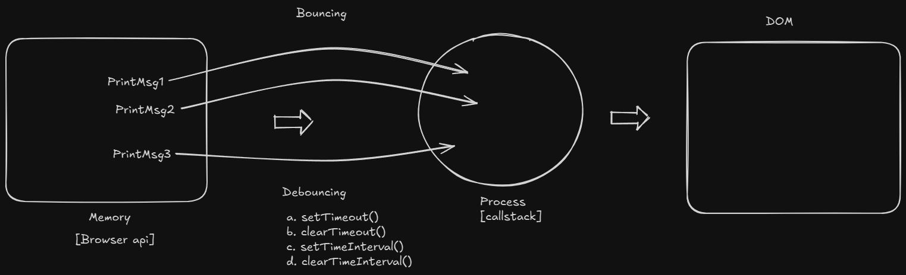
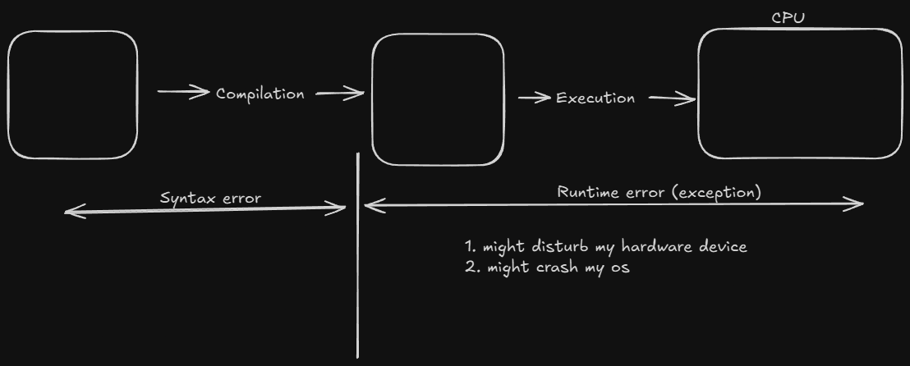
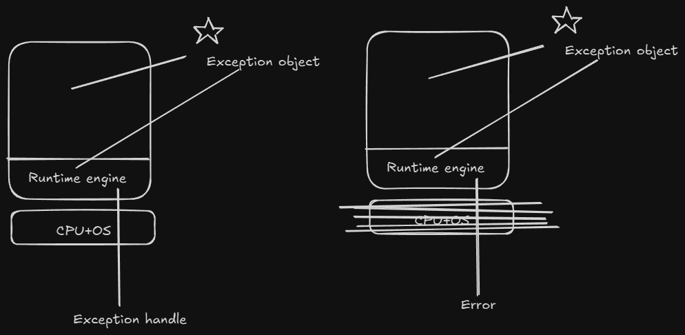

# 🟨 JavaScript

#### JavaScript is a lightweight, interpreted, and Just-in-Time (JIT) compiled programming language.

- **Lightweight**: Refers to the memory it occupies and how heavy the application is.
- **Interpreted**: Refers to line-by-line translation.
- **Compiled**: Refers to translating the entire program at once — all lines are translated simultaneously.


---

## 🌐 Client-Server Architecture


---

## ⚙️ Compilation Types

### a) 🔄 JIT (Just-in-Time) Compiled

- JIT is the process where JavaScript is loaded into the browser and compiled there.  
  This happens **when the user sends a request**.

### b) 🚀 AOT (Ahead-of-Time) Compiled

- AOT is the process where JavaScript is compiled and processed at the application level —  
  **even before any request is made**.

---

## 🧩 Engines and Compilers

- Some of the engines and compilers that can be used with JavaScript include:
  - **Ivy**
  - **Babel**
  - **Node**
  - **V8**


## 🧠 JavaScript Programming Approaches

- JavaScript supports various programming techniques and approaches:
  - **Structural Programming**
  - **Functional Programming**
  - **Imperative Programming**
  - **Object-Oriented Programming** *(limited)*

> 🔔 **Note:** *JavaScript is not a pure OOP language. It supports only a few features of OOP.*

---

## 🧩 JavaScript Usage in Different Layers

- JavaScript is a `programming language` used at different layers of a project:
  - 📄 **Client Side** — with `HTML`
  - 🌐 **Server Side** — with `Node.js`
  - 🗃️ **Database** — `MongoDB`
  - 🎞️ **Animation Tools** — *Flash*, *3DS Max*, etc.


## 🛠️ Full Stack JavaScript Flow
- **Frontend**
  - `React.js`

- **Backend**
  - `Node.js`
  - `Express.js`

- **Database**
  - `MongoDB (JavaScript based)`

## ❓ FAQ

### 1. What are the issues with JavaScript?

- **JavaScript is not "strongly" typed**
  - Example:
    ```javascript
    a = 10;
    a = "sachin";
    a = false;
    a = 13.5;
    ```
  - No fixed data type is enforced on a variable.

---
- **JavaScript is not "strictly" typed**
  - Example:
    ```javascript
    "use strict";
    a = 10; // Allowed even without declaration
    ```
  - Variables can be used without being declared unless strict mode is enabled.

---

- **JavaScript doesn't restrict uniform data structure**
  - Example:
    ```javascript
    [
      {
        Name: "samsung",
        price: 45000
      },
      {
        Product: "LG",
        cost: 55000
      }
    ]
    ```
  - Object keys and values are not enforced to follow a consistent schema.

---

- **JavaScript is not fully secure**
  - It can be blocked or manipulated by the browser.
  - Susceptible to misuse if used improperly.

  #### Examples:

  | Type  | Tool         | Description                                                |
  |-------|--------------|------------------------------------------------------------|
  | ❌ Bad | `Trojan`     | Installs secretly, allowing device control without consent |
  | ✅ Good | `TeamViewer` | Used for remote access with user permission                |

# 🌐 JavaScript Client Side

- The main purpose of JavaScript on the **client side** is to avoid burdening the server.

- It can **improve application performance** by handling various interactions on the client side.

---

## ⚙️ Interactions at the Client Side

### a. DOM Manipulations

- Adding elements into the page  
- Removing elements from the page  
- Updating data in elements  
- Configuring styles dynamically  
- Attaching events dynamically  

---

### b. Validations

- JavaScript is used to **verify user input** on the client side before sending it to the server.

---

### c. Client-Side Management

- **Managing Client Memory**  
  - e.g., Username and password stored in cache memory

- **Managing Client Devices**  
  - e.g., Booking a ticket and printing it offline (no internet needed)

- **Managing User Location**  
  - e.g., Websites that ask for your location

- **Data Sharing with Other Applications**  
  - e.g., Sharing files or data from the browser with installed apps

### 💡 How does JavaScript take control over HTML elements, or in how many ways can we use JavaScript code in an HTML page?


### Window Heirarchy


### ❓ FAQ

- 1️⃣ What is the MIME type for script?

  - `<script type='text/javascript'>` — Bulk loading  
    

  - `<script type='text/module'>` — Module-based loading (⚡ higher performance)  
    

---

- 2️⃣ What is the difference between script in `<head>` and `<body>`?

  - **Head**: Script is loaded into **browser memory** and later used in the page  
  - **Body**: Script is loaded **directly into the page** and is not stored in browser memory

---

- 3️⃣ How does JavaScript convert Static DOM into Dynamic DOM?
  - **HTML →** HTML parser → Static DOM(Document Object Model)
  - **CSS →** CSS parser → Uses static DOM and changes the style of an element using CSSOM(CSS Object Model).
  - **JS →** JavaScript engine → Uses STATIC DOM and converts it into Dynamic DOM using 'events and functions'.

---

- 4️⃣ What is strict mode in JavaScript?

  - If we want to prevent JavaScript from using undeclared variables, we use `"strict mode"`.

  ```html
  <script type="text/javascript">
    "use strict";
    a = 10;
    console.log(a); // ❌ Uncaught ReferenceError: a is not defined
  </script>
  ```

--- 

- 5️⃣ How to target JavaScript for Legacy browsers? (Old Version Browsers)

  - Developers can target new JavaScript code to legacy browsers by enclosing the code in HTML comments.

  ```html
  <script type="text/javascript">
    <!--
      "use strict";
      // your code here...
    -->
  </script>
  ```
---
- 6️⃣ How to link an external JavaScript file to HTML?
  ```html
  <script src="yourfile.js"></script>
  ```

---

### 🔍 JavaScript `properties` vs `textContent`


> 💻 Related Code : 
[dom-heirarchy-code.html](javascript-examples/dom-heirarchy-code.html)

---
### ⚠️ Disadvantage of Using DOM Hierarchy for Targeting Elements

- If we target elements using **DOM hierarchy**, the code might **break** when the DOM structure is altered or changed.


- ✅ Solution : Use **ID** to target the element directly and reliably:
  ```javascript
  document.getElementById("myElement");
  ```


### 🆔 Targeting Elements Using ID Selector

- We use the method:
  ```javascript
  const oneElement = document.getElementById('idname');
  ```
- If there are multiple elements with the **same ID**, the method will return only the first matching element.
  ```javascript
  document.getElementById("idname");
  ```

### 🎨 Style Binding to HTML Elements

- To bind a single CSS property to an element:
  ```javascript
  element.style.property = "value";
  ```
- ✅ To set multiple CSS properties in one line:
  ```javascript
  element.style.cssText = "cssKey1: value1; cssKey2: value2;";

  element.style.cssText = "color: blue; background-color: yellow;";
  ```

> 💻 Related Code : 
[multiple-id-code.html](javascript-examples/multiple-id-code.html)


### Various Types of Accessing Elements 🛠️
---
- 1️⃣ Accessing by Class Name 🏷️

  - `document.getElementsByClassName()` returns an **HTMLCollection[]**.

  - To convert an **HTMLCollection** to an **Array**, use:
    ```javascript
    const arrayElements = Array.from(htmlCollection);
    ```
  > 💻 Related Code : 
  [using-class-names](javascript-examples/using-class-names.html)

- 2️⃣ **Accessing by Tag Name 🏷️**  
  - `document.getElementsByTagName()` returns an **HTMLCollection[]**.  
  - Another approach to convert **HTMLCollection** to an **Array**:

    ```javascript
    const arrayElements = [...htmlCollection];
    ```
  > 💻 Related Code : 
  [using-tag-names](javascript-examples/using-tag-name.html)

- 3️⃣ **Accessing by Name 🏷️**  
  - `document.getElementsByName()` returns a **NodeList**.  
  - While working with **NodeList**, you can directly use **`forEach()`** without any conversion.
  > 💻 Related Code : 
  [using-name](javascript-examples/using-name.html)

> 🔔 **Note:** *Instead of remembering all these methods, you can use a method called*  
> `querySelector(cssSelector)` | `querySelectorAll(cssSelector)`  
> *to target the elements in an HTML page.*
> 
> - `querySelector(cssSelector)` returns an **Element** 🔍  
> - `querySelectorAll(cssSelector)` returns a **NodeList** 📑
> > 💻 Related Code : 
  [query-selector](javascript-examples/query-selector.html)

### 🔄 Working with Iterator: `forEach`
- `forEach` can be used **only on Array objects**.

  ```javascript
  const callbackFunction = (value, index, arr) => {
    // value -> current element
    // index -> index of the current element
    // arr   -> the entire array
  };

  // Usage
  array.forEach(callbackFunction);
  ```


### ❓ **FAQ:**  

1. Why do we need so many methods to target HTML elements using JavaScript, when we can target directly with a single method called `querySelectorXXX()`?
  
    - Older versions of JavaScript added methods like  
    `getElementById()`, `getElementsByClassName()`, `getElementsByTagName()`, etc.  
    As CSS became more popular, to give direct support for accessing elements using CSS selectors,  
    methods like `querySelector()` and `querySelectorAll()` were introduced.

      - `querySelector` | `querySelectorAll` | `getElementById` ➡️ works only for **static DOM**  
      - `getElementsByClassName()` | `getElementsByTagName()` | `getElementsByName()` ➡️ works with **dynamic DOM** 
    


  
### Static vs. Dynamic DOM Access — What’s the difference? 🔄
---
#### Static DOM Access ⚡
- Happens once, at the time of accessing.
- If DOM elements change later, the reference **does not update**.
- Example: `querySelectorAll()` returns a **NodeList**, which is **static**.

---

#### Dynamic (Live) DOM Access 🔄
- Reflects changes **automatically**.
- If new elements are added or removed, the collection **updates itself**.
- Example: `getElementsByClassName()` returns an **HTMLCollection**, which is **live**.
---
> 💻 Related Code : 
  [static-dynamic-dom](javascript-examples/static-dynamic-dom.html)


### JavaScript Output Operations 💬

- 1️⃣ **`alert()`** 🚨  
- 2️⃣ **`confirm()`** ✅❌  
- 3️⃣ **`document.write()` | `document.writeln()`** 📝  
- 4️⃣ **`innerHTML` | `outerHTML`** 🔄  
- 5️⃣ **`innerText` | `outerText`** 📝  
- 6️⃣ **`textContent`** 🖋️  
- 7️⃣ **`console.XXXXX()`** [log(), warn(), error(), info(), debug()] 🖥️


---

#### 1️⃣ `alert(msg)` 🚨: `void`
- Displays a message with an "OK" button.
- Returns `undefined` when the user clicks "OK" or presses the "ESC" key.
- Primarily used to display messages.

##### Limitation 🚫
- ❌ No styling can be added to the message.
- ❌ No "Cancel" button, so the user must click "ESC" to exit.

---

#### 2️⃣ `confirm(msg)` ✅❌: `boolean`
- Displays a message with "OK" and "Cancel" buttons.
- Returns `true` when the user clicks "OK" and `false` when the user clicks "Cancel".

##### Limitation 🚫
- ❌ No styling can be added to the message.

> 💻 Related Code : 
  [confirm-code.html](javascript-output-techniques\confirm-code.html)
---
#### 3️⃣ `document.write(msg)` 📝

- Accepts `msg` as a **string** or **HTML elements**.
- Directly writes content into the HTML document.

---

##### Limitation 🚫
- `document.write()` can behave **unexpectedly** if used **after** the page has finished loading — it can overwrite the entire document.


##### ⚙️ Output Behavior of `document.write()`

###### 🔍 What Happens When You Click the Button?

- 🧨 The entire existing page (including the button, heading, etc.) gets **wiped out**.
- Only the content inside `document.write(...)` is displayed.

###### ❓ Why Does This Happen?

- After the page finishes loading, `document.write()` acts like:
  > "Let me 🧹 rebuild the entire document from scratch now!"

> 💻 Related Code : 
  [document-write-code.html](javascript-output-techniques/document-write-code.html)
---
#### 4️⃣ `innerHTML` vs `outerHTML` 🧱

- **`innerHTML`**: Adds the element as a **child** to the targeted container or element. 👶  
- **`outerHTML`**: **Replaces** the entire targeted element with the newly provided one. 🔁

> 💻 Related Code : 
  [innerHtml-vs-outerHtml.html](javascript-output-techniques/innerHtml-vs-outerHtml.html)
---
#### 5️⃣  `innerText` vs `outerText` ✍️

- Works like `innerHTML` and `outerHTML` ✅  
- But only for **text content** — no HTML or styles allowed 🛑
> 💻 Related Code : 
  [innerText-vs-outerText.html](javascript-output-techniques/innerText-vs-outerText.html)
---

#### 6️⃣ `textContent` 🖋️

- Used to get or set the **text content** of an element.
- Returns all the text within an element, **including text from hidden elements**.
- Does **not parse HTML**—purely works with plain text.
- Ideal when you're working with content programmatically and **don't need styling awareness**.
---

##### 📌 Difference: `innerText` vs `textContent`

- **`textContent`**  
  ✔️ Returns **all text**, including from **hidden elements**  
  ✔️ **Faster** and better for **raw text**  
  ✔️ Ignores CSS layout and visibility  

- **`innerText`**  
  ✔️ Returns only **visible text**  
  ✔️ Respects **CSS visibility** and **layout**  
  ✔️ Includes **line breaks and spacing** as shown on screen  

> ⚠️ Use `textContent` for performance.  
> 🎯 Use `innerText` for accurate, visible representation.

---
#### 7️⃣🧾 Logs

- Logs refer to the **actions performed by the end user**.  
To **track user behavior or activity**, we use logs in JavaScript (commonly via `console.log()` or other logging tools).


> 💻 Related Code : 
  [console-log.html](javascript-output-techniques/console-log.html)
---

### JavaScript Input Mechanism ✍️

- 1️⃣ **`prompt()`** 💬  
- 2️⃣ **`queryString`** 🔗  
- 3️⃣ **`formelements`** 📝

#### 1️⃣ `prompt()` 📥


- 🧾 **Return Type:** `string` (or `null`)

  ```javascript
  prompt("MSG", [default msg]);
  ```

##### 🧪 **Behavior:**

- ✅ If user enters data and clicks OK → `'data'` (string)
- ⚠️ If user doesn’t enter anything but clicks OK → `''` (empty string)
- ❌ If user clicks Cancel or presses ESC (with or without entering data) → `null`


> 💻 Related Code : 
  [prompt-code.html](javascript-input-techniques/prompt-code.html)


#### 2️⃣ `queryString` 🔗

- A combination of **URL + queryParameters (Key, Value)**  
- To collect the query string, we use the **BOM (Browser Object Model)**:

  ```javascript
  const queryString = location.search;
  ```
- Query string data is received as a string
- You can use string methods to process it:
  - slice(start)
  - indexOf('')
> 💻 Related Code : 
  [query-string-code.html](javascript-input-techniques/query-string-code.html)

--- 
## 🌐 Global Execution Context

### 🚀 How JavaScript Program is Executed (or How JavaScript Runs in the Browser)

- When JavaScript is loaded into the browser's engine, it forms an **Execution Engine** ⚙️

- Inside the **Execution Context**, there are two main areas:

  - 🧠 **Memory (Variable Environment)** – stores variables and function declarations  
  - 🔁 **Code Execution (Thread of Execution)** – executes code line by line
---

### 🖥️ JavaScript in Browser Engine  


---

### 📦 Execution Context Stack
* First, a **Global Execution Context (GEC)** is created automatically 🌐  
  Then, whenever a function is invoked, a **new Execution Context** is created and pushed onto the **Call Stack**, as shown below:


---

#### 📝 Additional Points:

* JavaScript is **synchronous and single-threaded** 🧵 — it can only execute one command at a time in a specific order.

* The **Call Stack** 📚 keeps track of execution contexts — the one on top is always the currently running context.

* The **Execution Context** is created in two phases:
  1. 🔍 **Memory Creation Phase** – variables and functions are stored in memory (hoisted).
  2. ▶️ **Code Execution Phase** – code runs line by line using the stored memory.


#### ⚓ Hoisting

- Hoisting is a phenomenon in JavaScript where **variables and functions can be used before they are initialized**.
- If a `var` variable holds a **function expression** or an **arrow function**, it **cannot** be used before initialization.
- Trying to do so will result in a **`TypeError`**.

> 🔔 **Note:**  
> ✅ `undefined` is printable.  
> ❌ `null` and `void` are not printable as meaningful output.


> 💻 Related Code : 
  [hoisting.html](global-context/hoisting.html)
### 🔍 Lexical Environment & Scope Chain

- **Lexical Environment** 🧠  
  Memory of its own container + memory of its parent container

- **Scope Chain** 🔗  
  Refers to the chain of lexical environments used to identify the variable or function to access


> 💻 Related Code : 
  [variable-overriding.html](global-context/variable-overriding.html)

> [window.html](global-context/window.html)

### 🧠 `var` vs `let` vs `const`

#### 🟡 `var`
- ✅ Supports **hoisting** (initialized as `undefined`)
- 🔁 **Redeclaration** is allowed
- 🔄 **Reassignment** is allowed
- 📦 Function-scoped
- 🧥 Supports **shadowing**

---

#### 🔵 `let`
- ⚠️ Supports **hoisting**, but in **Temporal Dead Zone (TDZ)**  
-  ❌ Cannot be accessed before initialization  
- 🧨 Throws `ReferenceError`
- 🚫 Redeclaration is **not allowed**
- 🔄 **Reassignment** is allowed
- 📦 Block-scoped
- 🧥 Supports **shadowing**

---

#### 🔴 `const`
- ⚠️ Supports **hoisting**, but in **Temporal Dead Zone (TDZ)**  
- ❌ Cannot be accessed before initialization
- 🚫 **Redeclaration** is not allowed
- 🚫 **Reassignment** is not allowed → ❌ Throws `TypeError`
- 📦 Block-scoped
- 🧥 Supports **shadowing**


### 🔁 Comparison of `var`, `let`, and `const`

| Feature                        | `var`                              | `let`                                   | `const`                                 |
|-------------------------------|-------------------------------------|------------------------------------------|------------------------------------------|
| 🔍 Scope                      | Function-scoped                    | Block-scoped                            | Block-scoped                            |
| 🚀 Hoisting                   | Yes (initialized as `undefined`)   | Yes (but not initialized)         | Yes (but not initialized)         |
| 🔁 Can be Reassigned          | Yes                                | Yes                                     | ❌ No                                    |
| 🔁 Can be Redeclared          | Yes                                | ❌ No                                    | ❌ No                                    |
| ⚠️ Temporal Dead Zone (TDZ)   | ❌ No                               | ✅ Yes                                   | ✅ Yes                                   |
| 🔄 Use in Loops               | ❌ Not safe (due to function scope)                 | ✅ Safe                                  | ✅ Safe (if no reassignment)            |
| Global object property | Yes (if declared globally) | No | No |

> 💻 Related Code : 
  [dataTypes.html](global-context/dataTypes.html)

### 🧾 Rules to Name a Variable in JavaScript

1. 🔤 Name must start with an alphabet, `_`, or `$`.
2. ⚙️ `_` is often used for configuration or internal constructs.  
   - Example:  
     `var productName;` → Fully implemented  
     `var _productName;` → Not yet implemented
3. ❌ Avoid special characters in variable names (as per ECMAScript standards).
4. 🔡 Names can be alphanumeric.  
   - Example: `var product2020;`
5. 🔠 Variable names are **case-sensitive**.
6. 🔢 Name length can be up to **255 characters**.
7. 🧩 Avoid using single-letter or overly long variable names.
8. 🚫 Do not use **reserved keywords** (45 total in JavaScript).
9. 🐪 Always use **camelCase**, and names should describe their purpose.  
   - Bad: `var u = "sachin";`  
   - Good: `var userName = "sachin";`


> 🔔 **Note:**
> - JavaScript object: `{key: value}` → Convert to JSON string using `JSON.stringify()`
> - JSON string: `"{key: value}"` → Convert to JavaScript object using `JSON.parse()`
> - 💻 Related Code: [json.html](global-context/json.html)


## 🔢 Number Type in JavaScript

JavaScript stores all numbers (whether typed by the user or written in code) using the  
**IEEE 754 double-precision floating point format (64-bit float)**.

### 🧮 Bit Allocation

| 🧩 Bits     | 🧠 Purpose                          |
|------------|------------------------------------|
| 1 bit      | Sign (0 = positive, 1 = negative)  |
| 11 bits    | Exponent (with bias of 1023)       |
| 52 bits    | Mantissa / fractional digits       |

### 📚 Number Concepts in JavaScript

| 📘 Concept                | 💡 JavaScript Behavior         |
|--------------------------|-------------------------------|
| Max Safe Integer         | `2^53 - 1`                    |
| Precision above limit    | ❌ Lost                       |
| Alternative for big nums | ✅ Use `BigInt`               |


> 🔔 **Note:**
Since number is floating point type it leads to precision issues

### 💡 BigInt in JavaScript

To store any large integer number **with precision**, we use `BigInt`. It's especially helpful when numbers exceed the safe integer limit of JavaScript (`2^53 - 1`).

---

### ⚠️ Precision Issue Example

```javascript
console.log(0.1 + 0.2); 
// Output: 0.30000000000000004 🤯
```

### 🤔 What If You Need Large Integers?

If numbers exceed **53-bit precision**, JavaScript introduces `BigInt` to handle them **without losing precision**.

```javascript
let c = 9007199254740993n;

console.log(c);             // 9007199254740993n ✅
console.log(c == c + 1n);   // false 👏 No loss of precision!
```

### 🔍 Example #1: Handling Large Integers

```javascript
let a = 9007199254740991;       // Max safe integer in JS
let b = 9007199254740992;       // Unsafe with Number
let c = 9007199254740993n;      // Safe with BigInt

console.log(a);         // 9007199254740991
console.log(b);         // 9007199254740992
console.log(c);         // 9007199254740993n
console.log(c + 1n);    // 9007199254740994n

console.log(a === a + 1);    // true ❌ Precision lost
console.log(c === c + 1n);   // false ✅ Precision retained
```

### 🔢 Converting Data from String to Number

- To convert the data from **String format** to **Number type**, we have 3 mechanisms:

  1. `parseInt()` | `parseFloat()`
  2. `Number()`

---

#### 1️⃣ `Number(input)`

- It expects the data to strictly be in **number format**. If any special symbols are part of the data, it will return `NaN` (Not-a-Number).

---

#### 2️⃣ `parseInt(input)`

- It expects the input to be in **string format**.
- It returns the number up to the point it encounters a special character.
- If the first symbol itself is a special character, it returns `NaN`.


### 🤔 `isNaN(input)` vs `Number.isNaN(input)`

---

### ✅ `isNaN(input)`

- Converts the input into a number using `Number()`.
- If the result is `NaN`, it returns `true`; otherwise, it returns `false`.

```javascript
isNaN("abc");     // true  ➡️  "abc" becomes NaN
isNaN("123");     // false ➡️  "123" becomes 123
```
> 💻 Related Code : 
  [isNaN.html](Data-types\isNaN.html)

### 🔍 `Number.isNaN(input)`

- It **doesn't perform any conversion** on the input.
- It simply checks whether the input is **strictly `NaN`**.
- Returns `true` if the input is `NaN`; otherwise, returns `false`.

```javascript
Number.isNaN(NaN);      // true ✅
Number.isNaN("NaN");    // false ❌ (string, not actual NaN)
Number.isNaN(undefined); // false ❌
```

> 🔔 **Note:** While performing `'+'` operation if one of the operand is NaN then the output would be `'NaN'`


> 💻 Related Code : 
  [arithmeticOperations.html](Data-types/arithmeticOperations.html)
### 📊 Country, Locale Code & Currency Code

| Country           | Locale Code | Currency Code | Example Amount (45,000) |
|------------------|-------------|----------------|--------------------------|
| United States     | `en-US`     | USD            | 45,000.00                |
| Germany           | `de-DE`     | EUR            | 45.000,00                |
| Japan             | `ja-JP`     | JPY            | ￥45,000                 |
| India             | `en-IN`     | INR            | ₹45,000.00               |
| United Kingdom    | `en-GB`     | GBP            | £45,000.00               |
| Canada            | `en-CA`     | CAD            | CA$45,000.00             |
| Algeria (example) | `ar-DZ`     | DZD            | 45 000,00 DA             |

> 💻 Related Code : 
  [localeString.html](Data-types/localeString.html)

> 🚀 **Mini Project**: [emi-calculator.html](Data-types/emi-calculator.html)

### 📚 String in JavaScript

Strings in JavaScript can be created in **three ways**:

1. `" "` – Double quotes  
2. `' '` – Single quotes (used internally by the JS engine)  
3. `` ` ` `` – Backticks (used by developers for **template literals** and string interpolation)

---

> 💻 **Related Code**:  [core-string.html](javascript-strings/core-string.html)

#### 🔍 Primitive vs Object String in JavaScript

- In JavaScript, strings can be created in two ways:

---

##### 1️⃣ **Primitive String**

```js
let str1 = "sachin";  // Created using string literal
console.log(typeof str1);  // Output: string
```

- ✅ Lightweight

- ✅ Faster performance

- ✅ Recommended for most use cases

- ✅ Directly usable in string operations

##### 2️⃣ String Object

```js
let str2 = new String("dhoni");  // Created using String constructor
console.log(typeof str2);  // Output: object
```
- ❌ Heavier, as it is an object

- ❌ Not recommended for comparisons due to object behavior

- ⚠️ Can lead to unexpected behavior in equality checks

> 💻 **Related Code**:  [primitive-vs-obj-string.html](javascript-strings/primitive-vs-obj-string.html)


#### 🧵 Working with Backticks `` ` ``

- Backticks (`` ` ``) in JavaScript are used to create **template literals**, which allow:

  - **Multi-line strings**
  - **String interpolation** using `${}`

> 💻 **Related Code**: 
>> [expression-binding.html](javascript-strings/expression-binding.html) <br>
>> [template-exp-med.html](javascript-strings/template-exp-med.html) <br>
>> [label.html](javascript-strings/label.html)

> 🚀 **Mini Project**: [otp-verification.html](javascript-strings/otp-verification.html)


## 🔗 Binding in JavaScript

**Binding**  
- The process of attaching a variable with its value at runtime is referred to as **Binding**.

---

### 🔄 Data Binding

- Binding a variable with a value in output:

  ```js
  let userName = 'sachin';
  document.write(`${userName}`);   // Outputs: sachin
  document.write(`${username}`);   // ReferenceError (case-sensitive)
  ```
> 📝 Use `${variableName}` for dynamic content injection with template literals.

### 🎨 Style Binding

**Style Binding**  
- The process of attaching style-related details in an *inline* manner to an element is referred to as **style binding**.

  ```js
  // Set a single style property
  document.getElementById("myDiv").style.color = 'blue';

  // Set multiple styles using cssText
  document.getElementById("myDiv").style.cssText = 'background-color: yellow; font-size: 20px;';
  ```
> 💡 Style binding is useful when you want to dynamically apply styles directly via JavaScript without modifying external CSS.

### 🧩 Class Binding

**Class Binding**  
- The process of attaching a class associated with a style to an element is referred to as **class binding**.

```js
// Apply a user-defined or library CSS class to an element
document.getElementById("myElement").className = 'highlighted';
```

> 🎯 This is useful for dynamically switching or applying CSS styles using predefined classes from your stylesheet or a UI framework.

### ⚡ What is an Event?

**Event**  
- Anything that happens on a webpage is referred to as an **event**. Events allow web pages to respond to user interactions or browser actions.

#### 🔥 Common Events:

- `onclick` → Triggered when any element is clicked (e.g., a button).
- `onchange` → Triggered when the value of an input element is changed by the user.
- `onblur` → Triggered when an element loses focus.
- `onload` → Triggered when the page finishes loading in the browser.

> 💡 Events are the backbone of dynamic behavior in web applications.


### 🧵 String Formatting Methods in JavaScript

JavaScript provides several built-in string methods to format and style strings for display in HTML.

---

#### 🔠 Common Methods:

| Method             | Description                      | Returns     |
|--------------------|----------------------------------|-------------|
| `bold()`           | Makes the text **bold**          | HTML string |
| `italics()`        | Makes the text *italic*          | HTML string |
| `fontsize(number)` | Sets the font size               | HTML string |
| `fontcolor(string)`| Sets the font color              | HTML string |
| `toUpperCase()`    | Converts string to uppercase     | String      |

---

#### 🧪 Example:

```js
let str = 'sachin';
let str1 = str.toUpperCase();            // 'SACHIN'
let str2 = str1.bold();                  // '<b>SACHIN</b>'
let str3 = str2.fontcolor('red');        // '<font color="red"><b>SACHIN</b></font>'

document.write(str3);                    // Displays formatted output in red and bold
```

#### 🔗 Method Chaining:
```js
document.write(str.toUpperCase().bold().fontcolor('red'));
```

> 💡 Method chaining allows applying multiple transformations in a single line.

### ❗ JavaScript Error Types – Comparison Table

| **ReferenceError**                                       | **SyntaxError**                                         | **TypeError**                                  |
|----------------------------------------------------------|---------------------------------------------------------|-------------------------------------------------|
| 🔹 Variable is **not defined**                           | 🔹 Variable is already declared using `let` or `const`  | 🔹 Assignment to a constant variable (`const`)  |
| 🔹 Accessing variable **before initialization** (`let`, `const`) → Temporal Dead Zone (TDZ) |                                                         |                                                 |
| 🔹 Using a variable that is **not in scope**             |                                                         |                                                 |

#### 📏 Length of a String
- It counts the number of characters present in a given string.
```js
let str1 = 'sachin';                  // Primitive string
let str2 = new String('dhoni');       // String object created using String constructor

console.log(str1);                    // Outputs: sachin (primitive)
console.log(str2);                    // Outputs: [String: 'dhoni'] (String object)

console.log(str1.length);             // Outputs: 6 — length of the primitive string
console.log(str2.length);             // Outputs: 5 — length of the string inside the String object

console.log(str1.length()); //TypeError
```

> 💻 **Related Code**: 
>> [upg-otp.html](javascript-strings/upg-otp.html) <br>
>> [validate-username.html](javascript-strings/validate-username.html) 

> 🚀 **Mini Projects**: 
>> [change-theme.html](javascript-strings/change-theme.html) <br>
>>[remaining-chars.html](javascript-strings/remaining-chars.html)

### 📚 String Methods in JavaScript

| **Method**           | **Returns** | **Description**                                  |
|----------------------|-------------|--------------------------------------------------|
| `length`             | `number`    | Returns the number of characters in a string     |
| `startsWith(string)` | `boolean`   | Checks if the string starts with the given value |
| `endsWith(string)`   | `boolean`   | Checks if the string ends with the given value   |

---

#### 1️⃣ `startsWith()`

```js
let str = 'IPL2025';
console.log(str.startsWith('IPL')); // true

let str = 'IPL2025';
console.log(str.startsWith('ipl')); // false (case-sensitive)
```
#### 2️⃣ `endsWith()`

```js
let str = 'sachin@gmail.com';
console.log(str.endsWith('@gmail.com')); // true

let str = 'sachin@gmail.com';
console.log(str.endsWith('@yahoo.com')); // false
```

> 💻 **Related Code**: 
> [dynamic-atmcard.html](javascript-strings/dynamic-atmcard.html)

### 🔡 `charAt()` and `charCodeAt()` in JavaScript

| **Method**             | **Returns**        | **Description**                                    |
|------------------------|--------------------|----------------------------------------------------|
| `charAt(index)`        | `string` (1 char)  | Returns the character at the specified index       |
| `charCodeAt(index)`    | `number` (ASCII)   | Returns the UTF-16 code of the character at index  |

---

#### 🔢 ASCII Reference (for alphabets)

- `a` to `z` → ASCII **97 to 122**
- `A` to `Z` → ASCII **65 to 90**

---

  ```js
  let str = 'sachin';

  console.log(str.charAt(0));       // Output: 's'
  console.log(str.charCodeAt(0));   // Output: 115
  ```
> 💻 **Related Code**: 
> [username-uppercase.html](javascript-strings/username-uppercase.html)

#### 🔍 indexOf(string): number

- ✅ If the specified string is present, it returns the index of that character.
- ❌ Otherwise, it returns `-1`.

  ```js
  let str = 'javascript';

  console.log(str.indexOf('script')); // 4
  console.log(str.indexOf('Java'));   // -1 (case-sensitive)
  ```
> 💻 **Related Code**: 
> [indexOf.html](javascript-strings/indexOf.html)

#### ✂️ slice(starting, ending)

- `slice()` is used to extract the characters between the specified indices.

  ```js
  slice(start, end)  // Returns characters between start and end [end-1]
  ```
- Rule: Forward direction extraction. The end index must be greater than the start index.
Parameters.
  ```js
  slice(start)  // Returns from start to the end
  ```

#### 📋 Parameters:

- **startIndex** (required): The position where extraction begins (inclusive).  
  If negative, it is treated as `array.length + startIndex`.

- **endIndex** (optional): The position where extraction stops (exclusive).  
  If omitted, it extracts till the end.  
  If negative, it is treated as `array.length + endIndex`.

---

> 🔔 Note on `slice(start, end)`:
> - `NaN` → `0`
> - `null` → `0`
> - `undefined` → No parameter
> - `true` → `1`
> - `false` → `0`

> 💻 **Related Code**: 
> [slice.js](javascript-strings/slice.js)

### 📖 substring()

- `substring()` is used to read the characters between the given index range.

  ```js
  substring(startIndex, endIndex)  // endIndex can be -ve or +ve
  substring(startIndex)            // Returns from startIndex to endIndex-1
  ```
  ```js
  str.substring(7);     // From index 7 till the end of the string
  str.substring(7, 15); // From index 7 till index 14 of the string
  str.substring(7, 0);  // From index 0 till index 6 of the string
  ```
#### 📋 Parameters:
- **startIndex** (required): The index where extraction begins (inclusive).
- **endIndex** (optional): The index where extraction stops (exclusive).  
  If omitted, the substring extends to the end of the string.

---

#### 🔑 Key Points:
- If `startIndex` is greater than `endIndex`, they are swapped.
- If `startIndex` or `endIndex` is negative or `NaN`, they are treated as `0`.
- If `endIndex` is omitted, it extracts up to the end of the string.


### ✂️ `slice()` vs `substring()` in JavaScript

| **Feature**                         | **`slice()`**                     | **`substring()`**                  |
|------------------------------------|----------------------------------|------------------------------------|
| Supports negative indices?         | ✅ Yes                            | ❌ No (negative values treated as 0) |
| Swaps indices if `start > end`?    | ❌ No                             | ✅ Yes                              |
| Takes length instead of end index? | ❌ No                             | ❌ No                               |
| Recommended for use?               | ✅ Yes                            | ✅ Yes                              |

#### 🧰 Methods of String Object
===============================

- 🔠 **toUpperCase()** → `string`  
- 🔍 **startsWith(string)** → `boolean`  
- 🔚 **endsWith(string)** → `boolean`  
- 🔡 **charAt(number)** → `string`  
- 🔢 **charCodeAt(number)** → `number`  
- 📍 **indexOf(string)** → `number`  
  - `-1` if not found, otherwise returns the index  
- ✂️ **slice([start], [end])** → `string`  
- 🧵 **substring([start], [end])** → `string`  

> 💻 **Related Code**: 
> [substring-indexOf.html](javascript-strings/substring-indexOf.html)


### 🔗 split()

- Used to split the given string based on a delimiter  
- Accepts two arguments:
  - 🧵 `string` or `RegEx`: delimiter  
  - 🔢 `number`: limit (optional)

**Syntax:**  
```js
split(delimiter, limit) → string[]
```

### ⚠️ Corner Cases for `split()`

| Expression                           | Output                 |
|--------------------------------------|------------------------|
| `''.split()`                         | `['']`                |
| `''.split('')`                       | `[]`                  |
| `'hello user'.split()`               | `['hello user']`      |
| `'hello user'.split(undefined)`      | `['hello user']`      |
| `'hello user'.split(null)`           | `['hello user']`      |
| `'hello user'.split('', 0)`          | `[]`                  |
| `'P,W,,'.split(',')`                 | `['P', 'W', '', '']`  |
| `'P,W,'.split(',')`                  | `['P', 'W', '']`      |

> 💻 **Related Code**: 
>> [split.js](javascript-strings/split.js) <br>
>> [split.html](javascript-strings/split.html)

### ✂️ `trim()` Method

Removes **leading** and **trailing** spaces from a string.

---

```js
let str = '   sachin ramesh tendulkar  ';
console.log(str, str.length);
// Output: '   sachin ramesh tendulkar  ' 28

console.log(str.length, str.trim(), str.trim().length);
// Output: 28 'sachin ramesh tendulkar' 23
```
> 🔔 **Note:**  
In JavaScript, you can use conditional statements on methods or properties that return `object` or `null`.
This works because JavaScript **implicitly** checks the condition like:
```js
if (someOutput != null) {
  // ✅ Truthy case
} else {
  // ❌ Falsy case
}
```
```js
let str = ''.someMethod(input); // returns Object or null

if (str) {
  // Equivalent to: if (str != null)
  // ✅ process for true case
} else {
  // ❌ process for false case
}
```

> 💻 **Related Code**: 
>> [trim.html](javascript-strings/trim.html)  <br>
>> [verifyCase.html](javascript-strings/verifyCase.html)

### 🔍 `match(regEx)` Method

The `match()` method in JavaScript is used to retrieve the result of matching a string against a **regular expression**.

**Syntax:**
```javascript
string.match(regEx)
```

**Return Type:** `Array | null`  
- If a match is found → returns a non-empty array of matched values.
- If no match is found → returns `null`.

---

### 📌 Example Usages:

```javascript
let str = '9998887776';
let matchInput = /^\d{10}$/;
console.log(str.match(matchInput)); 
// ✅ Matches entire 10-digit number → returns non-empty array

let str = '999888777';
let matchInput = /^\d{10}$/;
console.log(str.match(matchInput)); 
// ❌ Doesn't match exactly 10 digits → returns null

let str = '9998887776';
let matchInput = /\d{10}/;
console.log(str.match(matchInput)); 
// ✅ Matches 10 digits anywhere in the string → returns match

let str = '999888777';
let matchInput = /\d{10}/;
console.log(str.match(matchInput)); 
// ❌ Only 9 digits → returns null

let str = '9998887776778';
let matchInput = /\d{10}/;
console.log(str.match(matchInput)); 
// ✅ Finds a 10-digit sequence within a longer string → returns match
```

---

### ✅ Recommended Practice

To ensure **exact match** from start to end of the string, always use `^` and `$` anchors:

- `^` → Matches the beginning of the string.
- `$` → Matches the end of the string.

```javascript
let str = '9998887776';
let matchInput = /^\d{10}$/;
console.log(str.match(matchInput)); 
// Ensures the full string is exactly 10 digits long
```

> **Note:** If you do not use `^` and `$`, the regex will **partially match** substrings within the input rather than the entire string.

```javascript
let str = '9998887776778';
let matchInput = /\d{10}/;
console.log(str.match(matchInput)); 
// Finds and returns the first 10-digit match even though the full string is longer
```

> 💻 **Related Code**: 
>> [regex.js](javascript-strings/regex.js) <br>
>> [str-match-regex.html](javascript-strings/str-match-regex.html)


# Boolean

## ✅ Boolean Type in JavaScript

In JavaScript, the **boolean** type has only two possible values:
- `true`
- `false`

### 🔢 Other values treated as Boolean:
- Any **non-zero number** (positive or negative): `true`
- **Zero (`0`)**: `false`

### 📌 Examples:
```javascript
console.log(Boolean(true));    // true
console.log(Boolean(false));   // false
console.log(Boolean(10));      // true
console.log(Boolean(-5));      // true
console.log(Boolean(0));       // false
```

---

### ✅ Common HTML Attributes That Behave Like Boolean

Certain attributes in HTML act like boolean flags — their mere presence implies `true`, and absence implies `false`.

### 📋 List of Boolean Attributes:

| Attribute   | Description                                      |
|-------------|--------------------------------------------------|
| `checked`   | Used in `<input>` (type checkbox/radio) to show it is selected |
| `readonly`  | Makes an input field non-editable                |
| `required`  | Specifies that the input must be filled out before submitting |
| `disabled`  | Disables an element                              |
| `border`    | (On `<table>` or ``) Indicates if border should be shown |

> ⚠️ `border` is not a standard boolean attribute like others, but behaves similarly in older HTML specifications (e.g., `<table border>`). Modern practice recommends using CSS instead.

> 💻 **Related Code**: 
[enable-disable.html](Data-types\enable-disable.html) 
## ➕ How `+` Operator Works in JavaScript

The `+` operator behaves differently based on the types of its operands:

### 🧠 Behavior:

- **If both operands are numbers:** Performs **Addition**
- **If one operand is a string:** Performs **Concatenation**
- **If one operand is a number and the other is boolean/null/undefined:** Converts to number and performs **Addition**

---

### 📌 Examples:

```javascript
console.log(5 + 10);             // 15 (number)
console.log(3.5 + 2.5);          // 6 (number)
console.log(-1 + 4);             // 3 (number)
console.log("3" + 2);            // "32" (string)
console.log(2 + "3");            // "23" (string)
console.log("5" + true);         // "5true" (string)
console.log(10 + "5");           // "105" (string)
console.log("5" + 10);           // "510" (string)
console.log("Result: " + 5 + 10);  // "Result: 510"
console.log(5 + 10 + " is the result"); // "15 is the result"
```

---

## ❓ Ternary Operator

### 📌 Syntax:
```javascript
condition ? value_if_true : value_if_false;
```

### 📌 Example:
```javascript
let age = 20;
let access = (age >= 18) ? "Allowed" : "Denied";
console.log(access); // "Allowed"
```

> 💻 **Related Code**: 
[ternary.html](Data-types/ternary.html)

# 🧠 Decision Making Operators and Statements

## 🔁 Comparison Operators

| Operator | Description               |
|----------|---------------------------|
| `==`     | Equal                     |
| `===`    | Identical Equal           |
| `!=`     | Not Equal                 |
| `!==`    | Identical Not Equal       |
| `>`      | Greater than              |
| `<`      | Lesser than               |
| `>=`     | Greater than or equal     |
| `<=`     | Less than or equal        |
| `&&`     | Logical AND               |
| `||`     | Logical OR                |
| `!`      | Logical NOT               |

---

#### ❓ FAQ

### Q1: What is the difference between `==` and `===`?
**A:**  
- `==` compares **values**, and **performs type conversion** if necessary.  
- `===` compares **both values and types** strictly — **no type conversion**.

#### ✅ Example:
```javascript
2 == '2'   // true  => Number('2') becomes 2
2 === '2'  // false => number !== string
```

---

### Q2: How to compare a value with a regular expression?

**A:**  
Use the `.match()` method of strings.

```javascript
let mobile = "+91987654210";
let regExp = /\+91\d{10}/;

mobile == regExp        // ❌ Invalid
mobile === regExp       // ❌ Invalid
mobile.match(regExp)    // ✅ Valid
```

---

### Q3: How to convert string `"true"` to boolean `true`?

**A:**
Use a comparison:

```javascript
let boolType = 'true' === 'true' ? true : false;
console.log(boolType, typeof(boolType)); // true 'boolean'
```

## 🔤 String Methods
a. `toLowerCase()` → string  
b. `toUpperCase()` → string  
c. `slice(start, end)` → string  
d. `indexOf(substr)` → number  
e. `split(delimiter, limit?)` → string[]  
f. `trim()` → string  
g. `substring(start, end)` → string  
h. `charAt(index)` → string  
i. `charCodeAt(index)` → number  
j. `match(regex)` → Array | null  

---

## ⚙️ Operators

### 🔹 Ternary Operator  
- `condition ? valueIfTrue : valueIfFalse`

### 🔹 Arithmetic Operator  
- `+`, `-`, `*`, `/`, `%`

### 🔹 Comparison Operators  
- `==` (loose equality)  
- `===` (strict equality)

---

## 🧾 Statements

### Definition  
Executable code which determines the control flow of the program.

---

## 🔀 Conditional Statements

a. `if`  
b. `if else`  
c. `nested if else`  
d. `switch | case | default | break`  

### 🔍 Syntax of `if`

```javascript
if (condition) {
    // statement of true part
}
```


### 🔁 if-else

- It is a conditional statement where:

  - The `if` block is executed when the condition evaluates to `true`.
  - If the condition is `false`, the `else` block is executed.
  - The `else` block does **not** require a condition — it simply handles all cases where the `if` fails.

#### 🔧 Syntax:
```javascript
if (condition) {
    // true block
} else {
    // false block
}
```

## 🧩 Nested if-else

- Used when decisions depend on **multiple conditions** — one inside another.

#### 🔧 Syntax:
```javascript
if (condition1) {
    if (condition2) {
        if (condition3) {
            // ✅ logic when all conditions are true
        } else {
            // ❌ logic when condition3 is false
        }
    } else {
        // ❌ logic when condition2 is false
    }
} else {
    // ❌ logic when condition1 is false
}
```
> 💻 **Related Code**: 
[nested-condtions.html](conditional-statements/nested-condtions.html)

## ✅ JavaScript Condition Evaluation: Truthy vs Falsy

In JavaScript, conditionals like `if (condition)` evaluate the **truthiness** or **falsiness** of the value.

---

### ❌ Falsy Values

The following values are considered **falsy**, meaning they evaluate to `false` in a conditional statement:

1. `0`
2. `""` (empty string)
3. `null`
4. `undefined`
5. `NaN`
6. `-0`
7. `0n` (BigInt zero)

```javascript
if (0) console.log("This won't run");
if ("") console.log("This won't run");
if (null) console.log("This won't run");
```

---

### ✅ Truthy Values

The following values are considered **truthy**, meaning they evaluate to `true` in a conditional statement:

1. Any **non-zero number** (positive or negative)  
2. Any **non-empty string**, including `" "` (a space) or `"sachin"`  
3. **Arrays** `[]` and **objects** `{}` (even if empty)  
4. **Functions** like `function() {}`  

```javascript
if (42) console.log("Truthy!");
if ("sachin") console.log("Truthy!");
if ([]) console.log("Truthy!");
if ({}) console.log("Truthy!");
```

--- 

✅ *Remember: JavaScript treats empty values, zeros, and undefined-like values as falsy — everything else is truthy!*

```js
let a = null;

if (a || "" || undefined || NaN) {
  console.log(true);
} else {
  console.log(false); // ➡️ This will print false
}
```
### Tricky 🤔
a. `NaN == NaN` ➡️ false ❌  
b. `NaN === NaN` ➡️ false ❌

```js
if (NaN === NaN) {
  console.log(true);
} else {
  console.log(false); // ✅ Prints false
}
if (null == undefined) {
  console.log("hello"); // ✅ Prints "hello" : null and undefined are reserved literals which would be mapping to same
} else {
  console.log("hey");
}
if (null === undefined) {
  console.log("hello"); // ✅ Prints "hey" :null[runtime] and undefined[compile time]
} else {
  console.log("hey");
}
// ✔️ null and undefined are equal using loose equality (==)
```

## 📦 Primitive Types in JavaScript

### Memory
- **Stack (LIFO)**
- **Fixed size & range**
- **Immutable**: Changes result in new memory allocation.

---

### 🔢 Number
- Based on **IEEE 754 (64-bit floating point)**
- **Type Conversions**:
  - `Number()`: Returns `NaN` or valid number (strict)
  - `parseInt()`, `parseFloat()`
- **Methods**:
  - `toString()`
  - `toLocaleString(locale, options)`

---

### 🧵 String
- **Property**: 
  - `length`
- **Common Methods**:
  - `slice()`
  - `trim()`
  - `split()`
  - `substring()`
  - `match()`
  - `charCodeAt()`
  - `indexOf()`

---

### ✅ Boolean
- Possible values: `true` or `false`
- **Falsy values**:
  - `0`
  - `""` (empty string)
  - `null`
  - `undefined`
  - `NaN`
  - `0n` (BigInt zero)
- **Truthy values**:
  - `[]` (empty array)
  - `"sachin"` (non-empty string)
  - `function(){}`
  - Any number > 0

---

### 💠 Other Primitive Types
- `null`
- `undefined`
- `BigInt`
- `Symbol`

---

### 🔎 Equality Checks

| Expression                | Result   |
|--------------------------|----------|
| `null === null`          | `true`   |
| `undefined === undefined`| `true`   |
| `NaN === NaN`            | `false`  |
| `NaN == NaN`             | `false`  |
| `null == undefined`      | `true`   |
| `null === undefined`     | `false`  |

---

### ❓ Difference: `null` vs `undefined`

| `null`                    | `undefined`                        |
|--------------------------|------------------------------------|
| Runtime value             | Compile-time (JS engine generated) |
| Explicitly assigned       | Automatically assigned by JS       |

---

### ⚙️ Logical Operators

```js
(condition1) && (condition2)
(condition1) || (condition2)
```

### 🧮 Programs

### 🔸 a. Largest of 2 Numbers
```js
if (a > b) {
  console.log("a is greater");
} else {
  console.log("b is greater");
}
```

### 🔸 b. Largest of 3 Numbers
```js
if (a > b && a > c) {
  console.log("a is greatest");
} else if (b > c) {
  console.log("b is greatest");
} else {
  console.log("c is greatest");
}
```

### 🔸 c. Check if value is within range
```js
function inRange(value, min, max) {
  return value >= min && value <= max;
}
```

### 🔸 d. Triangle Type
```js
if (a === b && b === c) {
  console.log("Equilateral");
} else if (a === b || b === c || a === c) {
  console.log("Isosceles");
} else {
  console.log("Scalene");
}
```
## 🔁 Switch in JavaScript

Used when comparing one input (`type`) against multiple predefined values.

### 🔹 Syntax
```js
switch(type) {
  case label1:
    // statements
    break;

  case label2:
    // statements
    break;

  default:
    // fallback
    break;
}
```

---

### 🧠 Important Notes on Switch

1. Comparison is **strict**: `type === label`
2. `default` block is optional and can appear **anywhere**
3. `break` prevents **fall through**
4. If `break` is omitted, **next case also runs**
5. You can **intentionally allow fall-through** by not using `break`
6. Only **one** `default` is allowed
7. **Duplicate cases** are valid
8. `case` labels can be of **any type** (boolean, string, object, etc.)

---

### ❓ FAQ

1. ✅ Can we define switch without default? — Yes  
2. ✅ Can default be placed anywhere? — Yes  
3. ✅ Can we omit `break` in a case? — Yes, but leads to fall-through  
4. ✅ Can we use `return` instead of `break`? — Yes, inside a function  
5. 🔄 `break` vs `return` — `break` exits switch, `return` exits function  
6. ✅ Case values as `"string"` or `true`? — Yes  
7. ✅ Multiple cases for one block? — Yes (fall-through mechanism)  
8. ❌ Case with a range? — Not directly, use `if-else` instead

```js
switch (true) {
  case (marks >= 90):
    console.log("A grade");
    break;
  case (marks >= 75):
    console.log("B grade");
    break;
  default:
    console.log("Needs improvement");
}
```

> 💻 **Related Code**: 
[switch.html](conditional-statements/switch.html)


## 🧠 Non-Primitive Types in JavaScript


## 🗃️ Key Characteristics
- 🔧 **Memory**: Allocated in the **Heap**
- 🏗️ **Structure**: Not fixed/predefined
- ♻️ **Mutable**: Changes reflect in the same memory

### Examples:
`Array`, `Map`, `Object`, `function(){}`

---

# 📦 Arrays in JavaScript

Arrays are used to store **multiple values** under a single variable name.

> 🔑 Internally stored as **key-value pairs** (index being the key).

> 🧠 Memory is **not** guaranteed to be contiguous.

---

### 🏗️ Array Creation Methods

1. **Dynamic Array**:
```js
let arr = new Array(size);  // creates an empty array of given size
```
2. **Static Array**:
```js
let arr = [val1, val2, val3, ...];  // direct initialization
```
> 🔔 **Note:** 

✅ You can store both **primitive** and **non-primitive** types inside an array.

🔢 Indexing in arrays happens internally as **strings** in the form of `key:value` pairs.

### Ways to Create Arrays

1️⃣ **Static Creation**  
Use square brackets to define an array directly with values.  
Example:  
`let arr = [value1, value2, value3];`

2️⃣ **Dynamic Creation**  
Use the `new Array(size)` constructor to create an array with a specified size.  
Example:  
`let arr = new Array(5);`

#### Different ways of reading an element from an array  
	a. using for loop 🌀  
		syntax : for(initialization ;condition ;counter){  
					//read the element using index   
					array[index]  
			 }   

	b. using property of the array[key|index] 🗝️  
		syntax : for(const property in object){  
				//read element using property  
				object[property]  
			 }  

	c. directly reading the value[element] from an array 🎯  
		syntax : for(const element of object){  
				console.log(element);  
			 }  

> 💻 **Related Code**: 
[array.html](Non-primitive/array.html)

### Array Destructuring  
➡️ Array destructuring is a syntax that lets you unpack values from arrays into individual variables in a clean and readable way.

🔹 eg#1. Without destructuring technique  
```js
let arr = ['sachin', 51, 53.4, true];
let userName = arr[0]; 
let userAge = arr[1]; 
let userAvg = arr[2]; 
let isMarried = arr[3];

console.log(arr);
console.log(userName, userAge, userAvg, isMarried);
```

🔹 eg#2. ✨ Using destructuring technique  
```js
let arr = ['sachin', 51, 53.4, true];
const [myName, myAge, myAvg, maritalStatus] = arr;
console.log(myName, myAge, myAvg, maritalStatus);
```

🔹 eg#3. 🧩 Function returning an array

```js
function presentData() {
    return ['kohli', 38, '56.5', true];
}

// Destructuring the array to unpack the values 
const [name, age, avg, married] = presentData();
console.log(name, age, avg, married);
```

🔹 eg#4. 🕵️‍♂️ Array destructuring to get the values not being unpacked  
```js
let arr = ['sachin', , 'M'];
console.log(arr);

const [name, age = 'Not Mentioned', gender, email] = arr;
console.log(age);      // 🧾 Default value used
console.log(email);    // ❌ Undefined as no value is provided
```

🔹 eg#5. Array destructuring to swap two variables without using temp

```js
let a = 10;
let b = 20;

console.log("Before swapping");
console.log("a =", a, "b =", b);

// Traditional way using temp
let temp = a;
a = b;
b = temp;

console.log("After swapping (using temp)");
console.log("a =", a, "b =", b);

// 🔁 Array destructuring without using temp
[b, a] = [a, b];
console.log();
console.log("After swapping (using destructuring)");
console.log("a =", a, "b =", b);
```

### 🧩 Object Destructuring  

1. While binding the object to unpack, the keys of the object should match the variable names used.  
2. If the variable name is different while unpacking, the value will be `undefined`.  
3. ✅ You can rename keys while unpacking using this syntax:  
    ```js
    const { keyName: newName, ... } = obj;
    ```
📦 eg#1. Without Object Destructuring

```js
let user = {
    userName: 'sachin',
    age: 51,
    gender: 'M',
    email: 'sachin@mi.com'
};

console.log(user);

const myName = user.name; // ❌ Incorrect key (should be userName)
const myAge = user.age;
const myGender = user.gender;
const myEmail = user.email;

console.log(myName, myAge, myGender, myEmail); // Output: undefined 51 M sachin@mi.com
```

📦 eg#2. With Object Destructuring

```js
let user = {
    userName: 'sachin',
    age: 51,
    gender: 'M',
    email: 'sachin@mi.com'
};

console.log("Using object destructuring");

const { userName, age } = user;
console.log(userName, age); // Output: sachin 51
```
🧐 eg#3. Object Destructuring but Key is Not Found While Unpacking

```js
let user = {
    userName: 'sachin',
    age: 51,
    gender: 'M',
    email: 'sachin@mi.com'
};

console.log("Using object destructuring");

// 🛑 'salary' key is not in the object, so we provide a default value
const { userName, age, salary = 'Not disclosed' } = user;

console.log(userName, age, salary); // Output: sachin 51 Not disclosed
```
🎯 eg#4. Using Our Own Keys for Object Destructuring

```js
let user = {
    userName: 'sachin',
    age: 51,
    gender: 'M',
    email: 'sachin@mi.com'
};

console.log("Object destructuring using our own keys");

// 🎭 Using alias names for destructured properties
const { userName: playerName, age: playerAge } = user;

console.log(playerName, playerAge); // Output: sachin 51
```

> 🔔 **Note:**

🎯 eg#1.
```js
let arr = [1, 2, 3];

// This sets the value at index 2 (as "2" gets converted to a number)
arr["2"] = 100; // Equivalent to arr[2] = 100
console.log(arr);        // Output: [1, 2, 100]
console.log(arr.length); // Output: 3 (length is based on numeric indices only)

// This adds a non-numeric property "sachin" to the array object (like an object property)
arr["sachin"] = 10;
console.log(arr);        // Output: [1, 2, 100, sachin: 10]
// Though it prints like an array with sachin property, this is actually an object key
console.log(arr.length); // Output: 3 (still only counts numeric indices)
```
🎯 eg#2.
```js
let arr = [1, 2, 3];

for (const key in arr) {
    delete arr[key]; // Deletes the value at the index, but not the index itself
}

console.log(arr);        // Output: [ <3 empty items> ]  OR [empty × 3]
console.log(arr.length); // Output: 3
```

#### 🔍 Reading values from array | Reading array elements

- 📜 **toString()** : It returns array elements separated with ","
- 🔗 **join()** : It returns array elements with custom delimiter
- 🚀 **map()** : It returns array elements using iterator [Best approach used in real-time coding]
- 🔁 **forEach()** : It returns array elements and their index references
- 🔎 **find()** : It returns the first occurrence of the element that matches the condition
- 🧹 **filter()** : It returns the elements that match the specified condition
- ✂️ **slice()** : It returns elements between specified indices


## 🗺️ Working with `map()`

### 💡 What does `map()` do?
- Returns a **new array**.
- Does **not mutate** the original array.
- Processes **each element** using a callback function.
- Returns the **same number of elements** as the original array.

### 📘 Syntax

```js
let newArray = array.map(function(element, index, array) {
  // return a new value for each element
});
```

### ⚡ Using Arrow Function
```js
array.map((element, index, array) => {
  // return new value
});
```

#### 🔧 Example
```js
let numbers = [1, 2, 3, 4];
let squares = numbers.map(num => num * num);
console.log(squares); // [1, 4, 9, 16]
```

> 💻 Related Code : 
>> [map1.html](Non-primitive/map1.html) <br>
>> [map2.html](Non-primitive/map2.html)


## 🔄 Working with `forEach()`

### 📘 What is `forEach()` in JavaScript?
- The `forEach()` method is used to iterate over each element in an array and perform an operation.
- It does **not return a new array**.

### 🧾 Syntax

```js
array.forEach(function(element, index, array) {
  // do something with element
});
```

### ⚡ Arrow Function Version

```js
array.forEach((element, index, array) => {
  // do something
});
```

#### 🌟 Features of forEach()
- Executes a callback function once for each element in the array.

- Returns undefined (does not return a value).

- Does not modify the original array unless explicitly changed inside the callback.

- Ideal for side effects like logging, DOM updates, etc.

```js
let items = ["All","Electornics","mobiles","kidsFashion"];

items.forEach(function(item){
    console.log(item);
})

console.log("*************************")

items.forEach(function(item,index){
    console.log(`${index+1}.${item}`)
});

console.log("*************************")
items.forEach(function(item,index,arr){
    arr[index] = item.toUpperCase();
})

console.log(items);
```


## 📦 Rest Operator in JavaScript

### ❓ What is the Rest Operator (`...`)?

- The **rest operator** is a syntax in JavaScript written as three dots `...`
- It is used to **collect multiple elements** into a single array or object.
- It’s like saying: “**Gather all the remaining elements into this variable.**”

---

### 🧠 Usage Contexts

| Context              | Example                         | What It Does                          |
|----------------------|----------------------------------|----------------------------------------|
| Function Parameters  | `function fn(...args) {}`       | Collects all arguments into array     |
| Array Destructuring  | `[a, b, ...rest] = [1,2,3,4]`    | Gathers remaining elements as array   |
| Object Destructuring | `{x, ...rest} = obj`            | Gathers remaining props as object     |

> 💻 **Related Code**: 
[restOper.html](Non-primitive/restOper.html)

## ➕ Array Methods for Inserting Elements

- `Array.push(...items)` → `number`  
  👉 Inserts elements at the **end** of the array.

- `Array.unshift(...items)` → `number`  
  👉 Inserts elements at the **beginning** of the array.

- `Array.splice(start, deleteCount, ...items)` → `array`  
  👉 Inserts elements at a specified position.  
  - If `deleteCount = 0`, no elements are removed.  
  - Used for inserting or replacing elements in the array.

- `Array.concat(...items)` → `array`  
  👉 Returns a **new array** with the inserted elements.

> 💻 **Related Code**: 
[arrIns.html](Non-primitive/arrIns.html)

## ❌ Array Methods for Deletion

- `Array.pop()` → `string | undefined`  
  👉 Removes the **last** element from an array.

- `Array.shift()` → `string | undefined`  
  👉 Removes the **first** element from an array.

- `Array.splice(start, deleteCount)` → `array`  
  👉 Deletes elements from a specified position.  
  - Returns the **deleted elements** as an array.
> 💻 **Related Code**: 
[arrDel.html](Non-primitive/arrDel.html)

## 🔢 Sorting the Elements in an Array

### Syntax
- `array.sort([compareFunction])` → `[]`
- `array.reverse()` → `[]`

### Types of Sorting

1. **Default Sorting**  
   - Sorts elements as **strings** based on Unicode values.  
   - ⚠️ Can lead to unexpected results with numbers.

2. **Custom Sorting**  
   Use a compare function:
   - If `(a - b) < 0` → `a` comes before `b`
   - If `(a - b) > 0` → `b` comes before `a`
   - If `(a - b) === 0` → Keep original order

---

### 🧪 Example #1: Default Sort on Numbers

```js
// Sorting the elements in an Array
let arr = [10, 5, 2];
let newArray = arr.sort(); // Sorts as strings: "10", "5", "2"
console.log(arr);       // Output: [10, 2, 5]
console.log(newArray);  // Output: [10, 2, 5]
```

#### 🧠 Explanation:
- "10" < "2" → true ✅ (No rearrangement)

- "2" < "5" → true ✅ (No rearrangement)

- Final result: [10, 2, 5]


> 💻 Related Code : 
>> [arrSort1.html](Non-primitive/arrSort1.html) <br>
>> [city-manager.html](Non-primitive/city-manager.html)

## 🧹 `filter()` Method in JavaScript

- Returns a new array containing elements that pass a test (i.e., return `true`) from a callback function.

### 🔧 Syntax

```js
array.filter(callback(element, index, array));
```

### 📌 **Parameters**

- **callback**: Function that tests each element.  
- **element**: The current element being processed.  
- **index** *(optional)*: The index of the current element.  
- **array** *(optional)*: The array `filter()` was called on.

> 💻 Related Code : [filter1.js](Non-primitive/filter1.js)


### ✅ Rules for Writing Arrow Functions
1. ❌ Do **not** use the `function` keyword.
2. 🧑‍💻 If only **one parameter**, omit the parentheses `()`.
3. 🧱 If only **one statement**, omit the curly braces `{}`.
4. 🔁 If the function **returns a value** in one statement, omit the `return` keyword.

```js
// Examples
const square = x => x * x;

const greet = name => console.log(`Hello, ${name}`);

const add = (a, b) => a + b;
```

# 🧮 `reduce()` Method in JavaScript

Reduces the array to a single value by applying a function to each element and accumulating the result.

## 🔧 Syntax
```js
array.reduce(callback(accumulator, currentValue, index, array), initialValue);
```

- accumulator: Accumulates the result.

- currentValue: Current element being processed.

- index (optional): Index of the current element.

- array (optional): The array reduce() was called on.

- initialValue: Optional value to start the accumulation.

```js
let num = [1, 2, 3, 4];
let answer = num.reduce(function(total, data) {
    console.log(total, data);
    return total + data;
}, 0);
console.log(answer); // Output: 10
```

### 🛒 Cart Example with `filter()` and `reduce()`

#### 📌 Initial Setup
```js
// Initial shopping cart with objects having id, name, price, and availability status
let cart = [
    { id: 1, name: 'Laptop', price: 50000, available: true },
    { id: 2, name: 'Mouse', price: 500, available: false },
    { id: 3, name: 'Keyboard', price: 1000, available: true },
    { id: 4, name: 'Monitor', price: 8000, available: false },
    { id: 5, name: 'USB Cable', price: 200, available: true }
];

console.log(cart); // Full cart data

// ✅ filter(): Used to extract items which are available (true)
let availableItems = cart.filter(item => item.available === true);
console.log(availableItems); // Only items where available === true

// ✅ reduce(): Used to accumulate total price of available items
let totalCost = availableItems.reduce(function(total, item) {
    return total + item.price; // Adds each item's price to running total
}, 0); // Initial total is 0

console.log(totalCost); // Final payable amount (sum of available items)

```
#### ⚡ Compact Code
```js
let cart = [
    { id: 1, name: 'Laptop', price: 50000, available: true },
    { id: 2, name: 'Mouse', price: 500, available: false },
    { id: 3, name: 'Keyboard', price: 1000, available: true },
    { id: 4, name: 'Monitor', price: 8000, available: false },
    { id: 5, name: 'USB Cable', price: 200, available: true }
];

// 🎯 One-liner: Filter available items & calculate their total price
let amountToBePaid = cart
    .filter(item => item.available)        // filters only available items
    .reduce((total, obj) => total + obj.price, 0); // sums up their prices

console.log(amountToBePaid); // Output: 51200
```

```js
let iplTeams = ["CSK","MI","CSK","MI","SRH","RCB","KKR","KKR","MI","CSK"];
        let result=iplTeams.reduce(function(obj,team){
                obj[team] = (obj[team]|0)+1
                return obj;
        },{})//{"CSK":2,"MI": 1,"SRH": 1,"RCB" : 1, "KKR":2}
        console.log(result);
```

# 🧱 Object

- **Object** contains:
  - **Properties** → data
  - **Methods** → logic

- **JSON** contains:
  - Only **properties** (data)

## 🧾 Syntax

```json
{
  "K": "V"
}
```

- Key must be of string type

- Value can be:

  - number

  - string

  - boolean

  - array

  - another object


## 📖 Syntax to Read JSON Data

- `product.key` or `product["key"]`
- `.` is called the **member invoking operator**

---

### 🆚 When to Use `obj.key` vs `obj["key"]`

#### ✅ Use `obj["key"]`:
- When key is a **variable** or **computed**.
- When key is **not a valid identifier** (e.g., contains `-`, starts with a number).

```js
const weirdObj = { "first-name": "sachin", "123": "number" };
console.log(weirdObj["first-name"]); // "sachin"
console.log(weirdObj["123"]);        // "number"
```

#### ✅ Use `obj.key`:

Use when:
- The key is **known ahead of time**.
- The key is a **valid identifier**:
  - ❌ No spaces  
  - ❌ No special characters  
  - ❌ Doesn’t start with a number

```js
const person = { name: "sachin", age: 51 };
console.log(person.name); // "sachin"
```
#### 🔧 Example
```js
console.log(user);
console.log('Username is : ',user.userName);
console.log('Teams is :');
user.teams.forEach(function(teamName){
    console.log(teamName);
});
console.log('Centuries is : ',user.records.Centuries);
console.log('Average   is : ',user.records.average);
console.log('Brand     is : ',user.records.Brand);

let weirdObj = {"first-Name" : 'kishan','123':'number'};
console.log(weirdObj);
console.log(weirdObj['first-Name']);
console.log(weirdObj['123']);
```


## 📥 Reading Data from JSON File

### 🔧 Syntax

```js
fetch("url_or_path")
  .then(function(response) {
    // ✅ On success: handle response
  })
  .catch(function(error) {
    // ❌ On failure: handle error
  })
  .finally(function() {
    // 🔁 Always executed: success or failure
  });
```


#### 🔍 Explanation
- fetch() – Used to retrieve data from a server or file.

- .then() – Called when the fetch is successful.

- .catch() – Called if the fetch fails (e.g., file not found, network error).

- .finally() – Always runs, whether the fetch succeeds or fails (e.g., hide loader).


#### 📄 /data/user-data.json
```json
{
  "userName": "sachin",
  "age": 51,
  "teams": ["MI", "CSK"],
  "records": {
    "Centuries": 100,
    "average": 53.5,
    "Brand": "MRF"
  },
  "isMarried": true
}
```

#### 📜 `<script>` to Fetch JSON
```js
const URL = '../data/user-data.json';

fetch(URL)
  .then(function(response) {
    console.log(response);          // Logs the raw response object
    return response.json();         // Converts response to JSON
  })
  .then(function(user) {
    console.log(typeof user);       // "object"
    console.log(user);              // Logs the parsed JSON data
  })
  .catch(function(error) {
    console.log(error);             // Logs any error (e.g. file not found)
  });

```

# 📜 Execution Flow of JavaScript Code by the Engine

## ☝️ Nature of JavaScript
- JavaScript is a **Single-Threaded** and **Synchronous** programming language.

---

## 🔧 JavaScript Components Used During Asynchronous Operations

### a. Call Stack
- Executes the main thread, line by line (synchronously).
- Function calls are pushed and popped in LIFO order.

### b. Web APIs (Browser APIs)
- Provided by the browser (not part of core JavaScript).
- Handles asynchronous operations like:
  - `setTimeout()`
  - `fetch()`
  - DOM Events (e.g., `onclick`)
  - AJAX, etc.

### c. Callback Queue (Task Queue / Message Queue)
- Stores callbacks from completed Web API tasks.
- Callbacks are **queued** and sent to Call Stack **only when it's empty**.

### d. Event Loop
- A **traffic cop** between Call Stack and Callback Queue.
- Continuously checks:
  - If the Call Stack is empty
  - Then moves the first task from the queue into the stack

### e. Microtask Queue
- Holds **Promises** (`.then()`, `.catch()`, `.finally()`)
- Has **higher priority** than the Callback Queue:
  - **Executed before** anything in the Callback Queue, once the Call Stack is clear
---

## 🔁 Flow of Execution (Step-by-Step)

1. **Call Stack** runs synchronous code line-by-line.
2. If an async function is called:
   - It is passed to **Web API**
3. Once async work is done:
   - **Callback function** is pushed to the **Callback Queue** (or Microtask Queue for Promises).
4. **Event Loop** checks if the Call Stack is empty:
   - If yes, it moves tasks from the Microtask Queue (first) or Callback Queue (next) into the Call Stack for execution.

```html
<script type="text/javascript">
    console.log("1. Start"); 
    // Synchronous → printed immediately

    // Asynchronous: setTimeout → goes to Web APIs, scheduled for 2 seconds later
    setTimeout(function () {
        console.log("2. Timeout happened");
    }, 2000);

    // Asynchronous: Promise → goes to Microtask queue
    Promise.resolve().then(function () {
        console.log("3. promise executed");
    });

    console.log("4. End");
    // Synchronous → printed immediately after "1. Start"
</script>
```


# 👨‍🍳 JavaScript Execution Analogy: The Chef in a Restaurant

## 🍳 Synchronous (Single-threaded)

- Imagine **one chef** in a kitchen.
- He can **only prepare one dish at a time**.
- Steps:
  1. Prepares Dish A → serves it.
  2. Then starts Dish B → serves it.
  3. And so on...

> 📌 This is like JavaScript running code **line-by-line**, **blocking** the next task until the current one is done.

---

## 🔔 Asynchronous (Timers, Tasks, and Event Loop)

- Now, the **chef is smarter**.
- He can **start cooking multiple dishes**.
- For each dish:
  - He sets a **timer** (e.g., oven or boiling water).
  - While waiting, he **starts another dish**.
- As soon as a dish is ready (timer rings), the chef **quickly finishes and serves** it — even if it's not in the original order.

> 📌 This is like JavaScript using **Web APIs** and the **Event Loop** to handle tasks **non-blockingly** — like `setTimeout`, `fetch`, etc.
---
> 💻 Related Code : 
[chef.html](javascript-asynch/chef.html)

# ⏳ `setTimeout()` in JavaScript

### 📘 What is it?
`setTimeout()` is a **Web API** function that lets you **delay the execution** of a function by a specific amount of time (in **milliseconds**).

---

#### 🧠 Syntax:
```js
setTimeout(callbackFunction, delayInMilliseconds, arg1, arg2, ...);
```

- `callbackFunction` ➡️ The function to run after the delay.
- `delayInMilliseconds` ⏱️ ➡️ Time to wait before running the function.
- `arg1, arg2, ...` ➕ Optional arguments to pass to the callback.

---

#### 🧪 Example #1

```js
let id = setTimeout(function (name) {
    console.log(`Hello : ${name}`);
}, 2000, 'sachin');

console.log(id);       // 🆔 Logs the timeout ID
clearTimeout(id);      // ❌ Cancels the timeout before it runs
```

> **📝 Note: setTimeout() Overview**

| 🔹 Purpose             | Run a function after a delay            |
|------------------------|-----------------------------------------|
| 🔄 Async/Sync          | Asynchronous (uses Web API)            |
| ⛔ Blocks execution?   | No (non-blocking)                      |
| 💡 Use cases           | Delay, retry, simulate timeouts, UI updates |
| ❌ Cancel it?          | Yes, using `clearTimeout(timerID)`     |

## What is a Promise?

- A **Promise** is an object representing the eventual completion or failure of an asynchronous operation.

> 📌 You ask for something → It can be **fulfilled** (success) or **rejected** (failure) after some time.

---

### ✅ Fulfilled → Positive result  
### ❌ Rejected → Failure/Error

---

### 📦 Syntax:

```js
let action = new Promise(function(resolve, reject) {
    // Asynchronous code
    let result = ''; // e.g., result of an API call

    if (result) {
        resolve(); // fulfilled
    } else {
        reject(); // rejected
    }
});
```

> 💻 Related Code : 
[promise.html](javascript-asynch/promise.html)

## What is `async` and `await`?

- `async` and `await` are modern syntax features in JavaScript that simplify working with **Promises**.  
They make asynchronous code look and behave more like synchronous code, making it easier to read and debug.

- **`async`**:  
  It is used to define a function that will be executed in **asynchronous mode**.  
  It ensures the function **always returns a Promise**.

- **`await`**:  
  It is used **inside an `async` function** to pause the execution until the Promise is **resolved** or **rejected**.  
  It tells the function to **wait for the result** before moving to the next line.
---

### 💡 In Simple Words:

> ✅ It's a cleaner way to **wait for a Promise** and handle the result — without chaining `.then()` and `.catch()`.

---

### 📜 Syntax

```js
// Function that returns a Promise
function somePromise() {
  return new Promise(function(resolve, reject) {
    // Simulate logic (e.g., API call, DB access)
        let success = true;

        if (success) {
          resolve("Success message");
        } else {
          reject("Something went wrong");
        }
    });
}

// Using async/await
async function processLogic() {
  try {
    let msg = await somePromise(); // Waits for Promise to settle
        console.log("Message:", msg);  // Uses the resolved value
    } catch (error) {
      console.error("Error:", error); // Catches any rejection
    }
}

processLogic();
```
> 💻 Related Code : 
>> [asynch-await.html](javascript-asynch/asynch-await.html) <br>
>> [asynch-await1.html](javascript-asynch/asynch-await1.html) <br>
>> [asynch-await2.html](javascript-asynch/asynch-await2.html) <br>
>> [asynch-await3.html](javascript-asynch/asynch-await3.html)

## FAQ: JavaScript Object Operations

1. **How to read all keys from Object?**  
**Ans**: `Object.keys(obj)` → returns a string array of keys.

2. **How to know the datatype of value in a Key?**  
**Ans**: Using `typeof` operator  
  Syntax: `typeof object[key]`

3. **How to get the count of keys in an Object?**  
**Ans**: Use the `length` property  
  `Object.keys(obj).length`

4. **How to read both keys and values in an Object?**  
**Ans**:  
`Object.keys(obj).forEach((key) => {`  
  `console.log(\`\${key} ---> \${user[key]}\`);`  
`});`

5. **How to remove a key dynamically?**  
**Ans**: `delete obj.key`  
> This deletes the key from the object, reducing the number of keys.

6. **How to check the availability of a key in Object?**  
**Ans**: Using `'in'` operator  
```js
if (key in obj) {  
 // key is part of the object  
} else {  
 // key is not part of the object  
}
```
7. **How to retrieve the values from an object?**  
**Ans**: `Object.values(obj)` → returns an array of values.

8. **How to retrieve both keys and values from an Object?**  
**Ans**: `Object.entries(obj)` → returns an array of [key, value] pairs.


> 💻 Related Code : 
>> [object1.html](javascript-asynch/object1.html) <br>
>> [object2.html](javascript-asynch/object2.html)

### Object Holding the Methods

- **Property**: Holds data  
- **Method**: Controls or manipulates the data

---

> 🔔 **Note:**
>> In the case of objects, if you assign a **regular function** as the value to a key, you can access the properties of that object using the `this` keyword **inside the function**.

>> However, this rule **does NOT apply** if you're using an **arrow function** as the value to the property.  
Arrow functions do **not have their own `this`**, so they inherit `this` from the parent scope.

> 💻 Related Code : [object3.html](javascript-asynch/object3.html)

## Reading the Response from an API

### ✅ Using `fetch()`:
The `fetch()` method is used to make HTTP requests and read responses from an API.

#### Syntax:
```js
fetch("url")
  .then((response) => {
    return response.json();  // converts response to JSON
  })
  .then((data) => {
    // use the data here
  })
  .catch((error) => {
    // handle errors
  });
```
---

#### ✅ Example:
```js
fetch("https://api.example.com/data")
  .then((response) => {
    return response.json();
  })
  .then((data) => {
    console.log(data);  // prints the actual data from the API
  })
  .catch((err) => {
    console.log("Error:", err);
  });
```
---

#### ✅ Notes:
- `response.json()` is asynchronous and returns a **Promise**.
- You can also use `.text()`, `.blob()`, or `.arrayBuffer()` depending on the response type.

> 💻 Related Code : 
>> [nasa.html](javascript-asynch/nasa.html) <br>
>> [jewellery.html](javascript-asynch/jewellery.html)

## Method

### 🔹 `findIndex((value, index, array))` → returns the **index** of the first element that satisfies the condition.  
- If no match is found, it returns **-1**.

---

#### ✅ Example:
```js
let users = [{ id: 10, name: 'sachin' }, { id: 18, name: 'kohli' }];

let index = users.findIndex(user => user.id === 18);
console.log(index);  // Output: 1

index = users.findIndex(user => user.id === 7);
console.log(index);  // Output: -1
```
---

#### ✅ Use case:
- Helpful when you want the **position** of an object in an array based on a condition.

> 💻 Related Code : [fakestore-cart.html](javascript-asynch/fakestore-cart.html)


## Map, Date, functions

1. What are the limitations of object ? 
    - Key must be of string type.
    - No standard api on its own to tell the no of keys present in an object.
    - Searching and deletion on its own cant be done it should be done with the help of operators
    - Best suited when data is structured, otherwise it would fail.

#### Map 
- Syntax : var refName = new Map();
- Map provides following method for manipulation

|Method name() | Description|
|---|---|
|set() | It is used to assign a new key with the value.|
|get() | It is used to access a value with the key reference|
|************************|*************************|
|keys() | It returns all keys|
|values() | It returns all values|
|entries() | It returns all keys and values|
|delete() | It remove a key and value|
|has() | It checks the availabilty of any key |
|clear() | It removes all keys |
|************************|*************************|
|size | It returns the total count of keys|

> 🔔 **Note:** : use for...of to iterate if we have data in map type.

> 💻 Related Code : 
>> [map1.html](javascript-asynch/map1.html) <br>
>> [map2.html](javascript-asynch/map2.html)

## Symbol Type

### What is "Symbol" type in JavaScript?

*Ans:* It is a *primitive datatype* in JavaScript.

- It is used for *unique identification* of any element in an object.
- It configures a *hidden key, which can be used individually but is **ignored in iterations* like for...in, Object.keys(), etc.

---

### How to configure a Symbol

```js
var ID = Symbol();
```

---

### Define key with Symbol type in an Object

```js
const user = {
  [ID]: 101,
  name: "Karthikeya"
};
```

---

### Access the Symbol key individually

```js
console.log(user[ID]); // 101
```

> 🔔 **Note:**  Symbols are not enumerable and won't appear in regular object iterations.

> 💻 Related code  :  [symbol-type.js](Non-primitive/symbol-type.js)

- we can create a Symbol() with the same key.
- Even if we create a Symbol() type with the same key still 2 different object would be availabe in memory.
- If we use == | === operator on Symbol() type with the same key the result would be false.
- We can use toString() on Symbol() to convert into String type while rendering an UI.


> 💻 Related code  :  [symbol2.html](Non-primitive/symbol2.html)

### Working with Date Type

- Date type is defined using JavaScript's `Date()` constructor.
- It allocates memory to store date-type values.
- The date is stored in **"Year-Month-Day"** format.
- It can handle both **date** and **time** values.

#### Syntax
- Load current system date and time:
  ```js
  var departure = new Date();
  ```
- Create date with full timestamp:
  ```js
  var departure = new Date("YYYY-MM-DD Hrs:Min:Sec.MilliSeconds");
  ```
- Create date with only date:
  ```js
  var mfd = new Date("YYYY-MM-DD");
  ```
##### Example
```html
<!DOCTYPE html>
<html lang="en">

<head>
    <meta charset="UTF-8">
    <meta name="viewport" content="width=device-width, initial-scale=1.0">
    <title>Document</title>
</head>

<body>
    <script type="text/javascript">

        let now = new Date();
        console.log(now);

        var mfd = new Date("2025-06-01");
        console.log(mfd);

        var departureTime = new Date("2025-06-19 20:45:36");
        console.log(departureTime)

    </script>
</body>

</html>
```

### JavaScript Date Object Methods

JavaScript `Date` object provides various methods to work with **date and time** values.

#### ⏰ Time Methods
- `getHours()` – Returns the hour (0 to 23)
- `getMinutes()` – Returns the minutes (0 to 59)
- `getSeconds()` – Returns the seconds (0 to 59)
- `getMilliseconds()` – Returns the milliseconds (0 to 999)

---

#### 📅 Date Methods
- `getDay()` – Returns the **weekday** (0 = Sunday, ..., 6 = Saturday)
- `getDate()` – Returns the **day of the month** (1 to 31)
- `getMonth()` – Returns the **month** (0 = January, ..., 11 = December)
- `getFullYear()` – Returns the **full year** (e.g., 2025)
- `getYear()` – **(Obsolete)** Returns the year minus 1900 (e.g., 125 for 2025)

> 💻 Related Code : 
[date1.html](date/date1.html)

### Conversion of Date Output as per User Requirements
- These methods help in formatting the `Date` object output based on locale or readable formats.

  - `toLocaleDateString()`  
    - Returns the date portion in a format specific to the user's locale.  
    - Example: `"6/9/2025"` or `"09/06/2025"` depending on locale.

  - `toLocaleTimeString()`  
    - Returns the time portion in a locale-specific format.  
    - Example: `"7:35:12 PM"` or `"19:35:12"` depending on locale.

  - `toString()`  
    - Converts the full date and time to a human-readable string.  
    - Example: `"Mon Jun 09 2025 19:35:12 GMT+0530 (India Standard Time)"`

> 💻 Related Code : 
>> [date2.html](date/date2.html) <br>
>> [date3.html](date/date3.html) 

### What is Closure?

- A **closure** is a function that remembers and has access to variables from its **lexical scope**, even when that function is executed outside that scope.

- In simple terms, an **inner function can access variables of its outer function**, even after the outer function has finished execution.

#### Example:

```js
function a() {
    var i = 10;
    function b() {
        console.log(i); // inner function accessing outer variable
    }
    b();
}
a();
```
### `setTimeout(callbackFunction, timerInMs, args)`
- Executes the `callbackFunction` **after** a delay specified by `timerInMs`.
- Any additional `args` are passed as arguments to the callback.

---

#### Important Notes:
- ✅ Function inside `setTimeout` **forms a closure** and remembers reference to `i`.
- ✅ Wherever the function goes, it **carries reference** to `i` along with it.
- ✅ The lines **after** `setTimeout` will execute **immediately**, without waiting.

---

##### Example:

```html
<script type="text/javascript">
    function x() {
        var i = 10;
        console.log("***************");
        setTimeout(function () {
            console.log(i);
        }, 3000);
        console.log("****************");
    }
    x();
</script>
```
#### Output : 
```
***************
****************
10       ← after 3 seconds
```

### ⏱️ How `setTimeout` Works in JavaScript

- It takes a **callback function** 🧠 and attaches a **timer** ⏳.
- The callback is stored in the **Web API environment** 🌐.
- Once the timer expires:
  - The function is pushed to the **Task Queue** 📥.
  - The **Event Loop** 🔁 moves it to the **Call Stack** only if it's empty.

---

### 🤔 Tricky Interview Question  
#### ❓ Print `1` after 1 sec, `2` after 2 sec... up to `5`

```js
for (var i = 1; i <= 5; i++) {
    setTimeout(function () {
        console.log(i);
    }, i * 1000);
}
```

#### ❌ Output:
```
6
6
6
6
6
```

### 💡 Why Does It Print 6 Every Time?

- 🧠 The callback **remembers reference** to `i`, not its value.  
- 🏃 The loop runs **completely before** any `setTimeout` executes.  
- 🔁 By the time callbacks run, `i = 6` for all.

### ❌ Problematic Version Using `var`
```html
<body>
    <script type="text/javascript">
        function x() {
            // Loop from 1 to 5
            for (var i = 1; i <= 5; i++) {
                // Set a timeout to log 'i' after i * 1000 milliseconds
                setTimeout(function () {
                    console.log(i);
                }, i * 1000);
            }
        }
        x(); // Call the function
    </script>
</body>
```

#### 🔴 Output:
6  
6  
6  
6  
6

#### ⚠ Why?
- `var` is **function-scoped**, not block-scoped.
- By the time the `setTimeout` callback runs, the loop has already completed and `i` is `6`.
- So each timeout logs the current (final) value of `i` → which is `6`.

---

### ✅ Fixed Version Using `let`

```html
<body>
    <script type="text/javascript">
        function x() {
            // Using 'let' creates a new block-scoped 'i' for each iteration
            for (let i = 1; i <= 5; i++) {
                // Now 'i' retains the correct value for each timeout
                setTimeout(function () {
                    console.log(i);
                }, i * 1000);
            }
        }
        x(); // Call the function
    </script>
</body>
```

#### 🟢 Output:
1  *(after 1 second)*  
2  *(after 2 seconds)*  
3  *(after 3 seconds)*  
4  *(after 4 seconds)*  
5  *(after 5 seconds)*

#### ✅ Why It Works?
- `let` is **block-scoped**, so each iteration captures its **own version** of `i`.
- The correct value of `i` is preserved in each `setTimeout` callback.

#### 💡 What if we need to get the functionality of `let` with `var` only?

To simulate `let` (block-scoped) behavior while using `var` (function-scoped), we can use a **closure** to preserve the current value of `i` during each iteration.

```html
<script type="text/javascript">
    function x() {
        for (var i = 1; i <= 5; i++) {

            function close(a) {
                setTimeout(function () {
                    console.log(a);
                }, a * 1000);
            }

            close(i);
        }
    }
    x();
</script>
```




#### ⚡ a. What is Debouncing?

- 🟠 **Bouncing**: In electronic devices, it's when a function is released immediately into memory without locking.
- 🟢 **Debouncing**: It's a technique where the function is **delayed** (locked) for a specific duration.
- ⏳ This helps in **controlling rapid events** and allows other tasks (like methods or APIs) to execute in the meantime.

---

#### 🛠️ b. How to Control Bouncing?

- 🧩 Use the following JavaScript tools:

  - ⏱️ `setTimeout(function () { }, timeoutMs);`  
    _(Delays the function execution by `timeoutMs` milliseconds)_

  - ❌ `clearTimeout(refName);`  
    _(Cancels a timeout set with `setTimeout`)_

  - 🔁 `setInterval(function () { }, intervalMs);`  
    _(Repeats function every `intervalMs` milliseconds)_

  - ❎ `clearInterval(refName);`  
    _(Stops the repeated execution set by `setInterval`)_

> 💻 Related Code : [hiiUser.html](date/hiiUser.html) 


#### ⏲️ setInterval()

- 🔧 **Syntax**:  
  `let intervalID = setInterval(function, delay, param1, param2, ...);`

  - `function` — The function to execute.
  - `delay` — Time in milliseconds between each function call.
  - `param1, param2, ...` — *(Optional)* Parameters to pass to the function.

- 🧠 **Behavior**:
  - 📦 Loads the specified task into memory.
  - 🔁 Repeatedly releases the task into process at regular intervals.
  - ♾️ Continues executing until manually stopped.

---

#### 🛑 clearInterval()

- 🔧 **Syntax**:  
  `clearInterval(intervalID);`

- 🧠 **Behavior**:
  - 🧹 Removes the interval task from memory.
  - 🛑 Stops further executions of the function associated with the `intervalID`.

> 💻 Related Code : 
>> [setIn1.html](date/setIn1.html) <br>
>> [setIn2.html](date/setIn2.html)

#### 🧩 What are Functions?

- 🔁 If we want to use a set of statements repeatedly, we encapsulate those statements using `{}` with the `function` keyword.
- 🎯 **Advantage**: Reusability

---

#### 🧠 JavaScript Function Execution

- 🧵 Every time a function is executed, a **new Execution Context** is created.
- 📚 This context becomes part of the **Call Stack**.
- 📦 Variables used inside functions have **block scope**.
- 🔄 Functions can return:
  - ✅ Primitive types (e.g., `number`, `string`)
  - 🧱 Non-primitive types (e.g., `objects`, other `functions`)

---

#### 📥 Parameters vs Arguments

- 🧾 **Parameters**:  
  Defined in the function declaration or expression. (Think of them as placeholders)

- 📤 **Arguments**:  
  Actual values passed while calling the function (like command-line arguments).

- 🧪 In JavaScript, both parameters and arguments can be:
  - ✅ Primitive values
  - 🧱 Non-primitive values (objects, arrays, functions)

---

#### 🫀 Functions Are First-Class Citizens

- 🧠 Functions can be:
  - Assigned to variables
  - Passed as arguments
  - Returned from other functions

> Hence, we call them:  
> **"First-Class Citizens"** or the **"Heart of JavaScript"**

---

#### 📝 Syntax

- 📌 **Function Declaration**:
  ```js
  function nameOfFunction(parameters) {
      // body of the function
      return ...;
  }
  ```
- 💼 **Function Expression**:
  ```js
  let add = function() {
    // body
  }
  ```
- **⚡ Arrow Function:**
  ```js
  let add = () => {
    // body
  }
  ```

#### ⚠️ Function Expression: Memory Behavior & Hoisting

- 📦 In the case of **function expressions**, memory allocation **changes dynamically** based on the state and situation during runtime.

- 🛑 **Note**:
  - Function expressions **are not hoisted**.
  - This is because the variable they’re assigned to is in the **Temporal Dead Zone (TDZ)** until the declaration is evaluated.

- 📌 Example:
  ```js
  console.log(sum); // ❌ ReferenceError: Cannot access 'sum' before initialization
  let sum = function(a, b) {
      return a + b;
  };
  ```
> 🧠 Unlike function declarations (which are hoisted entirely), function expressions behave like regular variables — they are hoisted without their assigned value, and trying to access them before declaration leads to a ReferenceError.

#### 💠 Difference b/w Arrow Functions and Function Expression

---

#### 📝 Syntax
```js
// Function Expression
const add = function(a, b) {
  return a + b;
};

// Arrow Function
const add = (a, b) => a + b;
```

#### ⚙️ this Behavior (Major Difference)

---

#### 🔹 Function Expression: `this` is dynamic – depends on how the function is called.

```js
const obj = {
  name: "Sachin",
  greet: function() {
    console.log("Hi " + this.name);
  }
};
obj.greet(); // Hi Sachin
```

#### 🔸 Arrow Function: this is lexical – it inherits this from the surrounding scope.
```js
const obj = {
  name: "Sachin",
  greet: () => {
    console.log("Hi " + this.name);
  }
};
obj.greet(); // Hi undefined (because `this` refers to outer/global)
```
```js
const obj = {
  name: "Sachin",
  greet: () => {
    console.log("Hi " + name);
  }
};
obj.greet(); // ReferenceError: name is not defined [searched in block scope]
```

#### 📦 What is `arguments` in JavaScript?

---

- `arguments` is a built-in object available **inside regular functions** (not in arrow functions).
- It contains all the arguments passed to the function — even if the function signature doesn't explicitly declare parameters.

---

#### 🔧 Function Expression Example

```js
function printArgs() {
  console.log(arguments);
}
printArgs(1, 2, 3); // [1, 2, 3]
```

#### 📋 `arguments` Object Features

| 🔹 Feature                 | 🔸 Value                                       |
|---------------------------|-----------------------------------------------|
| Type                      | Array-like object (not real array)            |
| Indexable                 | Yes (`arguments[0]`, etc.)                    |
| `.length` supported       | Yes                                           |
| Iterable with `for` loop  | Yes                                           |
| Real array methods        | No (need to convert it)                       |

---

#### 🔁 How to Convert `arguments` to Array

```js
function printArgs() {
  let args = Array.from(arguments);
  console.log(Array.isArray(args));
  console.log(args.map(x => x * 2));
}
printArgs(5, 10);
```

#### 🚫 Arrow Function Limitation
```js
const printArgs = () => {
  console.log(arguments);
};
printArgs(1, 2, 3); // Error: arguments is not defined
```
#### 📌 Points to Remember While Writing an Arrow Function (vs Function Expression)

---

- a. ✅ `arguments` inbuilt property is available in **function expressions**, ❌ not in arrow functions.
- b. ✅ `this` keyword refers to the current object in **function expressions**, ❌ refers to outer/global scope in arrow functions.
- c. ✅ Function expressions **can be used as constructors**, ❌ arrow functions **cannot** be used as constructors.

---

#### 🧪 Example #1: Constructor with Function Expression vs Arrow Function

```js
// ✅ Function Expression: works as a constructor
let Person = function (name) {
    this.name = name;
};

let obj = new Person("Sachin");
console.log(obj.name); // Sachin

// ❌ Arrow Function: not a constructor
let student = (name) => this.name = name;
let obj1 = new student("Sathya"); // TypeError: student is not a constructor
console.log(obj1.name);
```

#### 🔹 d. Anonymous Function

- a. Refers to a function without a name  
- b. As per ECMAScript standards, every function should have a name  
- c. If we want to call an anonymous function, we use **IIFE (Immediately Invoked Function Expression)**

---

#### 🧪 Example #1

```js
(function () {
    console.log("I don't have name to call");
})();
```

#### 🔹 e. Named Function Expression

```js
let doLogic = function helloUser() {
    console.log("I don't have name to call");
};

doLogic();     // ✅ Works
helloUser();   // ❌ ReferenceError
```

#### ❓ FAQ: Can a Function Return Multiple Values?

- ✅ **Ans**: Yes, a function can return multiple values based on conditions (**Conditional Rendering**).

---

#### 🧪 Example

```js
function getDetails(condition) {
    if (condition) {
        return [200, "Success"];
    } else {
        return [500, "Error"];
    }
}

const [status, message] = getDetails(true);
console.log(status);  // 200
console.log(message); // Success
```

> 💻 Related Code : [conditional-rendering.html](Non-primitive\conditional-rendering.html)


#### 🔁 What is a Callback Function?

- A **callback function** is a mechanism in JavaScript where a **function body is passed as an argument** to another function.
- It is the responsibility of the receiving function to **invoke the callback** whenever needed.
- Callback functions can be used in both:
  - ✅ **Synchronous** mode
  - ⏳ **Asynchronous** mode

---

#### 🛠️ Asynchronous Usage with Web APIs

- Common web APIs where callbacks are used:
  - `setTimeout()`
  - `fetch()`
  - `Promise`

> 💻 Related Code : [verifyUrl.html](Non-primitive/verifyUrl.html)

#### ⏳ Callback Used in Asynchronous Style

---

#### 📘 Promise – Like a Real-Life Promise

- A **Promise** represents the eventual completion (or failure) of an asynchronous operation.
- It has **3 phases**:
  - a. **Initial**  : Not yet started, ready to begin
  - b. **Resolved** : Successfully completed
  - c. **Rejected** : Unable to fulfill the promise

---

#### 🚀 Behavior

- Promises are **implicitly asynchronous**.
- They allow other tasks to execute without blocking the main thread.
- Promises offer **better performance** compared to synchronous callbacks.

---

#### 🔁 Replacing Callbacks with Promises

- Promises can be used **instead of callbacks** to handle asynchronous operations more cleanly.

---

#### 🔧 Promise Utility Methods

- `.then()` — Executes when the promise is **fulfilled**
- `.catch()` — Executes when the promise is **rejected**
- `.finally()` — Executes **in all situations**, whether fulfilled or rejected

> 💻 Related Code : [finally.html](Non-primitive/finally.html)

> 📝 **Note**:  
> The `finally` block of Promise handling will be executed **irrespective of** whether the promise is resolved (`resolve()`) or rejected (`reject()`).






#### 📦 Promise

```js
let promiseApi = new Promise(function (resolve, reject) {
    if (condition) {
        resolve();
    } else {
        reject();
    }		
});
```

#### 📲 Consuming the Promise
```js
promiseApi
  .then(function () {
      // successful
  })
  .catch(function (error) {
      // error handling
  })
  .finally(function () {
      // always runs
  });
```

#### ❓ Q: What is Exception and What is Exception Handling?

---

- ⚠️ **Exception**:  
  Exceptions are **runtime mistakes** that occur due to **faulty inputs** given by the user to the application.

- 💥 These mistakes can lead to **abnormal termination** of the application.

---

- 🛠️ **Exception Handling**:  
  To prevent abnormal termination, we use **exception handling mechanisms**.

- ✅ Exception handling promotes **graceful termination** of a program:
  - The program handles the error safely.
  - It does **not affect the OS** or the **hardware** of the user.
#### 🧾 Syntax: Exception Handling in JavaScript

```js
try {
    // risky code
} catch (error) {
    // handling code
} finally {
    // resource releasing code
}
```
> 📝 **Note**: Details in the `error` object

| Property | Description                        |
|----------|------------------------------------|
| `name`   | Type of error (e.g. `TypeError`)   |
| `message`| Description of the error           |
| `stack`  | Stack trace (developer information)|

> 💻 Related Code : 
>> [err1.html](Non-primitive/err1.html) <br>
>> [err2.html](Non-primitive/err2.html) <br>
>> [err3.html](Non-primitive/err3.html)

#### 🔁 Usage of `finally` Block

---

- ✅ It is a block that gets executed **irrespective of whether an exception occurs or not**.
- 🔐 Inside the `finally` block, we usually write the logic for **closing or releasing resources**.

---

```js
try {
    // risky code
} catch (error) {
    // handling code
} finally {
    // resource releasing code
}
```
> 💻 Related Code : [finally1.html](Non-primitive/finally1.html)

> 📝 **Note**:  
> All exceptions in JavaScript belong to **Unchecked Exceptions**.

#### ☸️ Rest Operator

---

- 📌 This operator is used to **bind multiple values** under a **single variable**.

---

#### 🧾 Syntax

```js
function collectData(...variable) {
    console.log(variable);
}

collectData(10, 'sachin', 53.5, true);
```

#### 📦 Object Destructuring with Rest
```js
let userData = {
    name: 'sachin',
    age: 51,
    gender: 'M'
};

const { name, ...otherDetails } = userData;
console.log(name);         // sachin
console.log(otherDetails); // { age: 51, gender: 'M' }
```

#### 🔄 Spread Operator

---

- ✅ It is used to **spread elements** into **multiple values**.

---

#### 🧾 Syntax

```js
function collectData(...variable) {
    console.log(variable);
}

let data = [10, 'sachin', 53.5, true];
collectData(...data);
```
> 💻 Related Code : [spread1.html](Non-primitive/spread1.html)


<!-- 28 -->
> Note : 
```js
catch(error){
  if(error instanceOf TypeError){
    // handling logic of TypeError
  }
  if(error instanceOf SyntaxError){
    // handling logic of SyntaxError
  }
  if(error instanceOf ReferenceError){
    // handling logic of ReferenceError
  }
}
```

- All exceptions in js are 'unchecked' exceptions (these exceptions are not checked by compiler during memory allocation phase).

<!-->30<!-->
### What is Shallow Copy?
- Shallow copy copies the top-level properties of an object only. If the object has nested objects or arrays, the references to those nested structures are copied - not the actual inner content.

```js
let obj = {
    'id' :  10,
    'name' : 'kohli',
    'gender' : 'M',
    'address' : {
        'city' : 'delhi'
    }
};

let cloneObj = {...obj};

cloneObj.name = 'sachin';
cloneObj.address.city = 'mumbai';

console.log(cloneObj); // { id: 10, name: 'sachin', gender: 'M', address: { city: 'mumbai' } }
console.log(obj); // { id: 10, name: 'kohli', gender: 'M', address: { city: 'mumbai' } }
```

### What is Deep Copy?
- A deep copy creates a completely independent clone of the object, including all nested objects and arrays. No shared references. To create a deep copy, we use method called 

### 📘 Rules of Rest Operators (`...rest`)

1. ✅ A function **can have only one rest parameter**.

   ```js
   function example(...a, ...b) {} // ❌ Invalid
   ```
2. ✅ You can combine normal parameters and a rest parameter, but:

- ❌ The rest parameter must be last.

- ✅ Example:

  ```js
  function greet(name, ...messages) {} // ✅ Valid
  function greet(...messages, name) {} // ❌ Invalid
  ```

3. ✅ Rest parameter reads all remaining arguments, so placing it last ensures correct behavior.

> ⚠️ Improper order or multiple rest parameters will throw a syntax error.

```js
function printData({id, ...otherData}){
    console.log(id);
    const{name, gender, isMarried, salary = 'NOT DISPLAYED'} = otherData;
    console.log(otherData);
    console.log(salary);
}
let userData = {id : '10', 'name' : 'sachin', 'gender' : 'M', 'isMarried' : true};
printData(userData)
```
### Function generator
- **Syntax :**
  ```js
    function* generatorFunction(){
      yield value1;
      yield value2;
    }
  ```


- `function*` → Declares a **generator function**.
- `yield` → **Pauses** the function and **returns a value**.
- `.next()` → **Resumes** the function and returns the **next `yield`ed value**

📌 Example:
```js
function* generateValues(){
    yield "sachin";
    yield "saurav";
    yield "shashu";
    yield "jumma";
}

let gen = generateValues();
console.log(gen);

let result = gen.next();

while(!result.done){
    console.log(result);//sachin, ....
    result = gen.next();//undefined, done : true
}
```

### Higher Order Functions
A function which accepts function as the parameter is called "Higher Order Function".

```js
const radius = [3, 4, 1, 2];

const area = function(radius){
    return (Math.PI * radius * radius).toFixed(2);
}
const circum = function(radius){
    return (2 * Math.PI * radius).toFixed(2);
}
const diam = function(radius){
    return (2 * radius);
}

//DRY : Don't repeat yourself

function calculate(radius, logic){
    let output = [];
    for(let i = 0; i < radius.length; i++){
        output.push(logic(radius[i]));
    }
    return output;
}

console.log(calculate(radius, area));
console.log(calculate(radius, circum));
console.log(calculate(radius, diam));
```

> Note : It is possible to make any user defined function to be a part of any inbuilt class.
>> ClassName.prototype.key = value[function(){}]

```js


```

